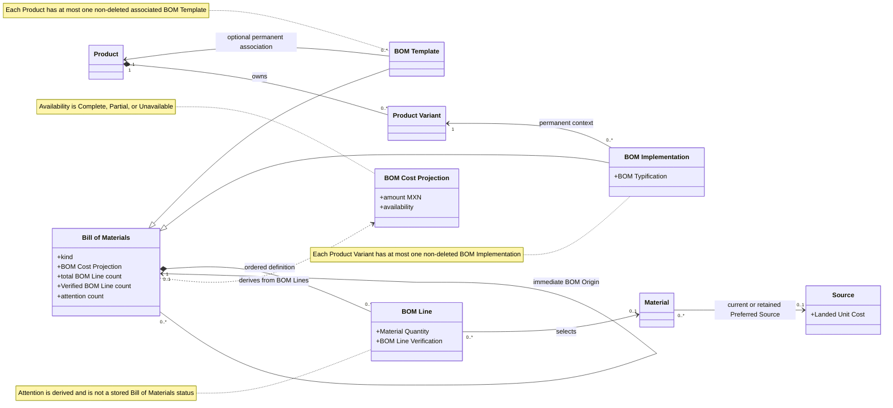
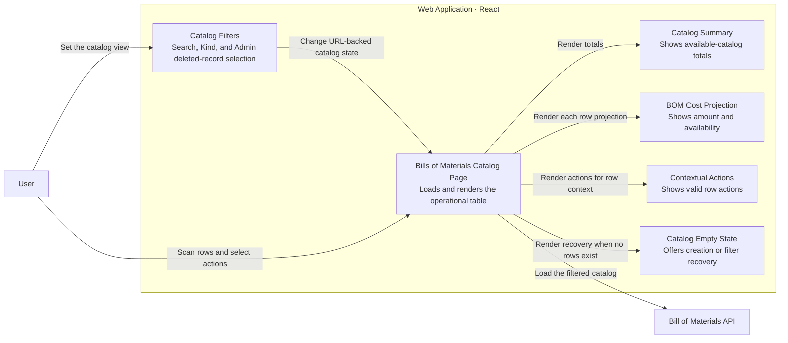
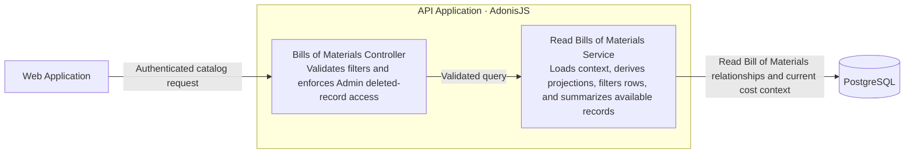
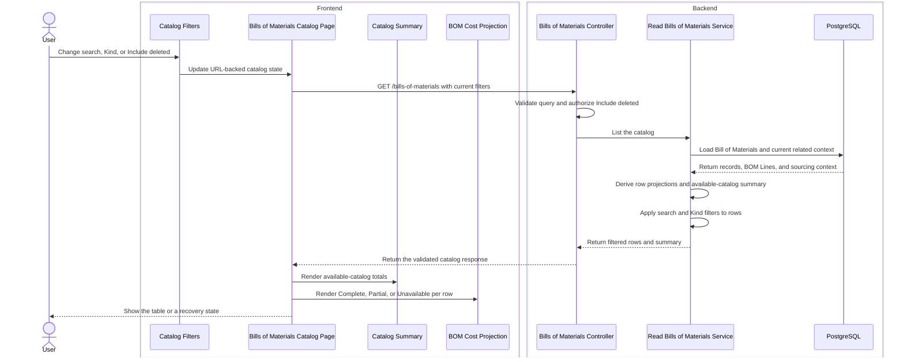

# Complete the Operational Bills of Materials Catalog

Issue 15 gives each User one operational catalog for BOM Templates and BOM Implementations. The catalog shows Product context, immediate BOM Origin, BOM Cost Projection, BOM Line Verification, attention conditions, and valid actions in a compact table. This change does not add a Product workspace or a master-detail view. The governing requirements are in [Issue 15](.scratch/bill-of-materials-builder/issues/15-complete-the-operational-bills-of-materials-catalog.md).

## Catalog Contract and Projection

The shared catalog contract now accepts `search`, `kind`, and `includeDeleted`. Each Bill of Materials summary now includes these derived values:

- Total BOM Line count.
- Verified BOM Line count.
- Count of BOM Lines that have at least one attention condition.
- Current BOM Cost Projection and BOM Cost Projection Availability.
- Available-catalog totals for BOM Templates, BOM Implementations, records without Product Variant context, and records with an Unverified BOM Line.

The [shared types](packages/shared-types/src/bills-of-materials.ts) and [shared validation](packages/shared-validation/src/bills-of-materials.ts) keep the API and Web Application on the same contract. The summary always describes non-deleted Bills of Materials. Search, Kind filters, and the Admin deleted-record view do not change these totals.

The [read service](apps/api/app/modules/bills_of_materials/services/read_bills_of_materials.ts) loads Product, Product Variant, immediate BOM Origin, BOM Lines, Material, Pattern Set, and current or retained Preferred Source context. The service derives each row projection from current records. It does not store a Bill of Materials status or a BOM Cost Projection.

Search is case-insensitive, ignores accents, removes leading and trailing whitespace, and collapses repeated whitespace. It matches Bill of Materials name and ID, Product name and ID, Product Variant name and ID, and immediate BOM Origin name and ID. The Kind filters select All, BOM Templates, or BOM Implementations. The controller ignores `includeDeleted` unless the current User is an Admin.

## Operational Catalog

The [catalog page](apps/web/src/features/bills-of-materials/bills-of-materials-catalog-page.tsx) lists BOM Templates and BOM Implementations in one table. The table has horizontal overflow and right-aligned numeric columns. Each row shows:

- Bill of Materials name and stable ID.
- Permanent kind.
- Product and Product Variant context.
- Immediate BOM Origin, including an Unavailable origin.
- Complete, Partial, or Unavailable BOM Cost Projection.
- Total and Verified BOM Line counts.
- BOM Lines that need review or attention.

Availability is not an ordinary column. A deleted record appears only when an Admin selects **Include deleted**. The row then shows a Deleted badge.

The [catalog presentation components](apps/web/src/features/bills-of-materials/components/catalog-presentation.tsx) own the summary cards, filters, BOM Cost Projection display, and empty states. The page distinguishes these states:

- Initial loading.
- A recoverable load failure with **Try again**.
- No registered Bills of Materials, with separate creation actions.
- No match for the current view, with **Clear catalog filters**.
- A populated operational table.

The route stores search, Kind, and deleted-record selection in the URL. A refresh or a shared URL restores the same catalog view.

## Contextual Actions

**Create BOM** keeps separate BOM Template and BOM Implementation actions. Each row keeps only actions that match its current context:

- A writable record offers **Edit Bill of Materials**. A read-only record offers **View Bill of Materials**.
- A non-deleted record can start BOM Derivation and can be deleted.
- An unassociated, non-deleted BOM Template can associate a Product.
- A non-deleted BOM Template with an available Product can create a BOM Implementation.
- A deleted record hides ordinary mutation actions. An Admin can restore it.

The catalog reuses the existing mutation dialogs and Builder flows. This issue changes action discovery. It does not change the mutation rules.

## Architecture Views

These views show only the domain relationships and runtime collaboration used by the issue 15 catalog.

### UML — Domain Relationships

### C4 Level 3 — Web Application

### C4 Level 3 — API Application

### C4 Dynamic — Load and Filter the Operational Catalog

## Focused Coverage

The focused tests prove these behaviors:

- The API returns row-level BOM Cost Projection, BOM Line Verification, attention-condition counts, and available-catalog summary values.
- The API search finds current Bill of Materials, Product, Product Variant, and immediate BOM Origin context. Matching ignores case and accents.
- The API filters by permanent kind and limits deleted-record access to Admins.
- The summary excludes deleted records and stays independent of the current search and Kind filters.
- The Web Application renders the compact table, horizontal overflow, summary cards, Product context, immediate BOM Origin, BOM Cost Projection Availability, and BOM Line review context.
- URL state initializes and updates catalog filters and server requests.
- Operators do not see deleted-record controls. Admins can include and open deleted records.
- Empty and filtered-empty states offer the correct recovery action.
- A catalog failure keeps its message visible and supports a successful retry.
- Row actions remain contextual for Product association, BOM Implementation creation, BOM Derivation, edit or read-only detail, delete, and restore.
- The endpoint serializes search, Kind, and deleted-record filters for same-origin requests.

The API coverage is in [bills_of_materials.spec.ts](apps/api/tests/functional/bills_of_materials/bills_of_materials.spec.ts). The route and endpoint coverage is in [-bills-of-materials.test.tsx](apps/web/src/routes/-bills-of-materials.test.tsx) and [endpoints.test.ts](apps/web/src/features/bills-of-materials/api/endpoints.test.ts).

## Focused Verification

- Focused Web Application Bill of Materials catalog and endpoint tests — 29 of 29 pass.
- Full Web Application test suite — 110 of 110 pass.
- Focused issue 15 API catalog and attention tests — pass in isolation.
- API Application, Web Application, Shared Types, and Shared Validation typechecks and build checks — pass.
- Focused API Application, Web Application, Shared Types, and Shared Validation linters — pass.
- Whole Bill of Materials API test file — 43 of 52 pass. The nine failures are unrelated shared-state failures from the existing concurrently installed `issue_12_reject_copy` database trigger. No issue 15 catalog test failed.
- Independent Standards review — pass with zero findings.
- Independent Spec review — pass with zero findings.
- `git diff --check` — pass.
- Mermaid heading, fence, and structure checks — pass.

The complete `pnpm quality` gate did not run. The final quality gate belongs to the User and CI.

## Scope Boundaries

- The catalog is not a Product workspace and is not a master-detail interface.
- Availability is not a dedicated ordinary column.
- BOM Cost Projection, BOM Cost Projection Availability, BOM Line Verification totals, and attention totals remain derived read data. They are not stored Bill of Materials status.
- The summary describes all non-deleted Bills of Materials. It does not describe only the filtered rows.
- This issue does not change creation, BOM Derivation, Product association, delete, or restore business rules.
- This issue does not add roles or change Admin and Operator authority.

## Review Closure

The independent Standards review passed with zero findings. The independent Spec review passed with zero findings. No review action remains for issue 15.

## Remaining Risk

The whole Bill of Materials API file does not run in isolation from every concurrently installed database trigger. The existing `issue_12_reject_copy` trigger causes nine shared-state failures in the aggregate run. Focused issue 15 API tests pass, but the aggregate isolation problem remains outside this issue.

The architecture context map points to `architecture/how-to-choice.md`, but that file is absent. This handoff uses the implemented seams and does not infer the missing guidance.

## Commit State

The issue 15 implementation and this reviewer handoff are uncommitted and not pushed. The current `HEAD` is `4cca0b5`, the completed issue 14 commit.
