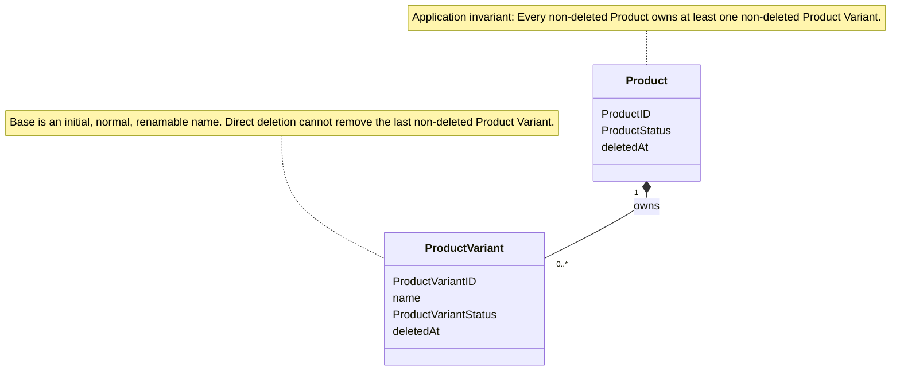
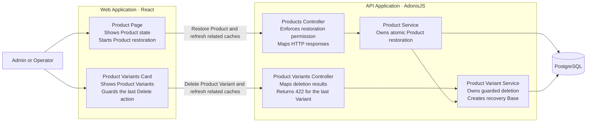
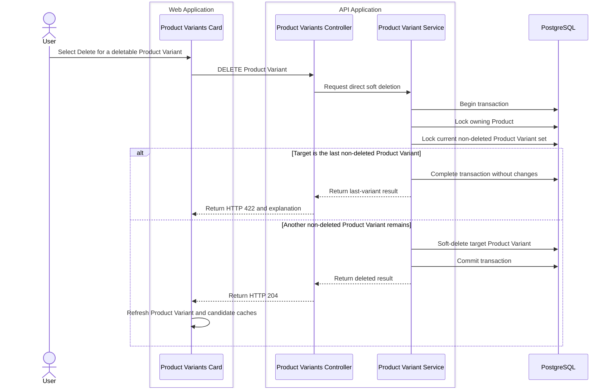
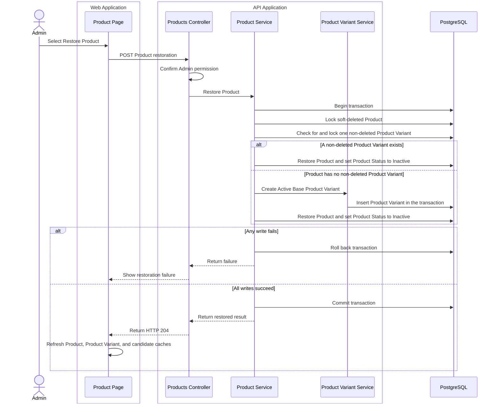

# Products Keep a Required Product Variant Through Delete and Restore

Product Variant deletion and Product restoration now preserve the required Product Variant rule under normal and concurrent use. The change protects the last non-deleted Product Variant, recovers an exceptional empty Product during restoration, and keeps Product soft deletion and Bill of Materials behavior unchanged.

## Protected Product Variant Deletion

The [Product Variant service](apps/api/app/modules/products/product_variants_service.ts) starts a database transaction before direct deletion. It locks the owning Product first. This lock also applies when the Product is soft-deleted. The service then locks and evaluates the current set of non-deleted Product Variants.

The service rejects deletion when the target is the last non-deleted Product Variant. The [Product Variant controller](apps/api/app/modules/products/controllers/product_variants_controller.ts) returns HTTP `422` with an instruction to create another Product Variant. The Product lock serializes Product Variant creation, restoration, and deletion. Concurrent deletion attempts can delete only one of two remaining Product Variants.

The [Product Variants card](apps/web/src/features/products/components/product-variants-card.tsx) keeps the last Product Variant's Delete action visible. The action is disabled, and the card explains that the user must create another Product Variant first. After the user creates a replacement, the existing confirmation and deletion flow becomes available. A successful deletion refreshes Product Variant and Product Variant candidate caches.

## Atomic Product Restoration

The [Product service](apps/api/app/modules/products/products_service.ts) restores a Product in one database transaction. It locks the Product, then checks for and locks one current non-deleted Product Variant. If the Product is empty, the service creates one Active Product Variant named `Base`. If the Product already has a non-deleted Product Variant, the service changes no Product Variant.

The Product restoration and optional `Base` creation commit together. If the `Base` insert fails, the transaction rolls back and the Product remains deleted. A successful restoration refreshes Product detail, Product list, Product Variant, and Product Variant candidate caches.

Product soft deletion still preserves Product Variants, Bills of Materials, and their relationships. The existing read-only rules for Bills of Materials remain in force when a related Product or Product Variant is soft-deleted.

## Architecture Views

### UML — Domain Relationships

### C4 Level 3 — Product Variant Lifecycle

### C4 Dynamic — Guarded Product Variant Deletion

### C4 Dynamic — Atomic Product Restoration

## Focused Coverage

The focused tests prove these behaviors:

- A Product Variant can be soft-deleted when another non-deleted Product Variant remains.
- Direct deletion returns HTTP `422` when the target is the last non-deleted Product Variant.
- Last-Variant protection also applies when the Product is soft-deleted.
- Concurrent deletion attempts leave one non-deleted Product Variant.
- An Operator can use ordinary Product Variant deletion, and only an Admin can restore a Product.
- The Product Variant route keeps the last Delete action visible, disabled, and explained.
- The route enables the ordinary confirmation and deletion flow after a replacement exists.
- Restoring an exceptional empty Product creates one Active `Base` Product Variant.
- Restoring a Product with retained Product Variants changes none of them.
- A failure after the recovery `Base` insert leaves the Product deleted and leaves no partial Product Variant.
- Product restoration refreshes Product Variant and Product Variant candidate caches.
- Product and Product Variant soft deletion keep related Bills of Materials preserved and read-only.

## Focused Verification

- API Product/Product Variant — 26/26 passed.
- BOM lifecycle — 9/9 passed.
- Product Variant route + Product cache — 10/10 passed.
- API TypeScript — passed.
- Web TypeScript + route generation — passed.
- Focused API ESLint — passed.
- Focused web Oxlint — passed.
- `git diff --check` — passed.

## Scope Boundaries

- `Base` remains a normal, renamable Product Variant name. It has no permanent role or protected name.
- The required Product Variant rule is application-enforced. It is not a database constraint.
- This change adds no hard deletion and no cascade deletion.
- Product soft deletion still preserves Product Variants, Bills of Materials, and their relationships.
- Bill of Materials read-only and restoration rules are unchanged.
- Product availability actions are unchanged.
- The complete `pnpm quality` gate did not run.
- Existing unrelated working-tree changes remain preserved.

## Commit State

The feature is uncommitted and has not been pushed.
