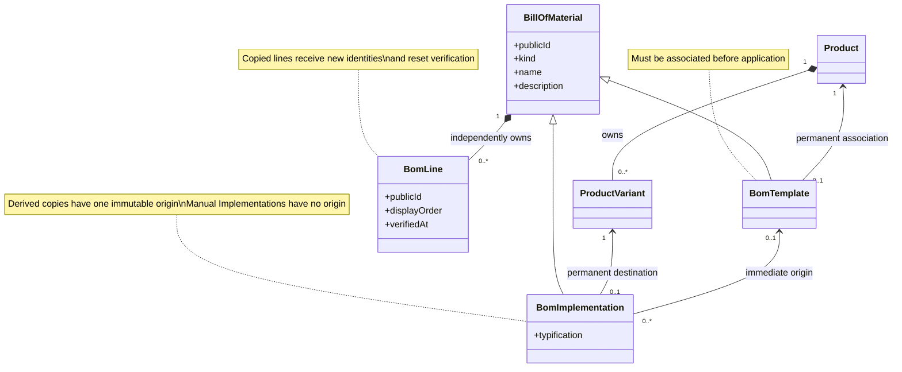
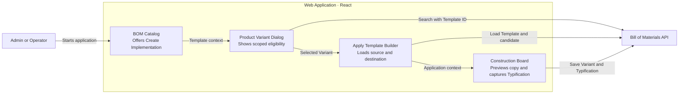
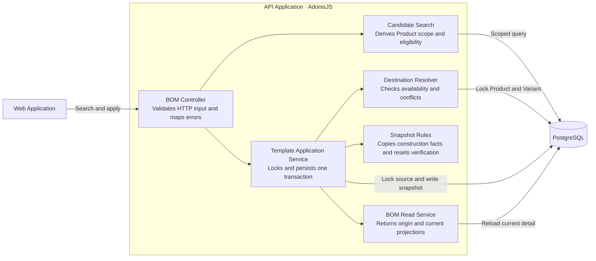
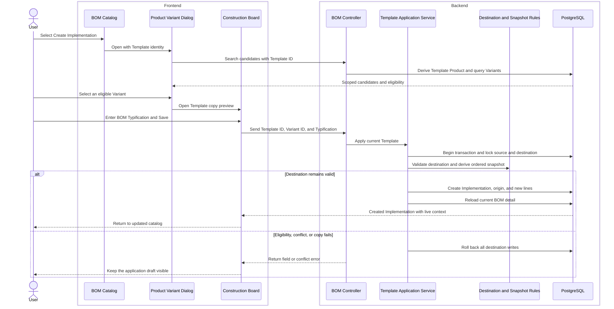

# Create an Independent BOM Implementation from a Template

An Admin or Operator can now turn an associated BOM Template into an independent BOM Implementation for an eligible Variant of that Product. The workflow reuses the Construction Board, while the API owns the authoritative copy at Save; this slice does not add live propagation, editable pre-Save composition, or broader candidate-search hardening.

## Choose an Eligible Destination

An available, Product-associated Template now exposes **Create Implementation** from its catalog row. The action opens the existing Product Variant dialog in Template context, so the server derives the allowed Product from the Template rather than trusting a Product ID from the browser.

Candidate results include only Variants of that Product and retain the existing eligibility rules:

- The Product and Product Variant must still be available.
- The Product Variant cannot already have a BOM Implementation.
- The destination BOM Typification must be unique within the Product, ignoring case.
- An unassociated, deleted, or otherwise unavailable Template cannot be applied.

The relevant entry points are the [catalog](apps/web/src/features/bills-of-materials/bills-of-materials-catalog-page.tsx), the [Product Variant dialog](apps/web/src/features/bills-of-materials/components/product-variant-candidate-dialog.tsx), and the server-owned [candidate search](apps/api/app/modules/bills_of_materials/services/search_product_variant_candidates.ts).

## Preview the Copy in the Construction Board

After the User selects a Variant, the application opens the same Construction Board used for BOM creation and editing. It shows the Template description and ordered composition, identifies the immediate origin, fixes the selected Variant, and asks for a separate BOM Typification.

The copied composition is intentionally read-only before the first Save. This makes it clear that the board is previewing what will be copied, while avoiding a second client-authored version of the Template. If Save fails, the board remains open with the selected Variant, entered Typification, and copied preview intact.

[ApplyTemplateBuilder](apps/web/src/features/bills-of-materials/apply-template-builder.tsx) loads the Template and selected candidate, then supplies Template-application context to the shared [BomBuilderPage](apps/web/src/features/bills-of-materials/create-bom-template-page.tsx). Centralized Builder capabilities disable composition changes only for this pre-Save copy flow. The [persistence seam](apps/web/src/features/bills-of-materials/use-bom-builder-persistence.ts) sends only the Template ID, Product Variant ID, and BOM Typification.

## Create One Authoritative Snapshot

`POST /bills-of-materials/:templateId/implementations` creates the destination in one database transaction. The [application service](apps/api/app/modules/bills_of_materials/services/apply_bill_of_materials_template.ts) locks and revalidates the source Template, destination Product and Variant, and ordered source lines before writing anything.

The operation then:

- Creates a new BOM Implementation identity.
- Records the source Template as its immutable immediate BOM Origin.
- Copies the current Template description and ordered BOM Lines.
- Gives every copied line a new identity and independent ownership.
- Copies Construction Piece, Material, Material Quantity, Pattern Set, Line Note, and relative order.
- Resets every copied line to Unverified.
- Leaves the source Template unchanged.

The shared [destination resolver](apps/api/app/modules/bills_of_materials/services/implementation_destination.ts) keeps manual and Template-derived creation aligned on availability, occupancy, and Typification conflicts. The pure [snapshot rules](apps/api/app/modules/bills_of_materials/services/template_application_snapshot.ts) define the copy whitelist and verification reset without persistence concerns.

Unavailable retained Materials and Retired Pattern Sets may be copied because they are part of the source construction record. Source, Vendor Shade, cost evidence, Pattern Set proposal history, and line-level lineage are not copied. The destination detail is reloaded through the normal read model, so sourcing, attention, Pattern Set context, and cost projections reflect current catalog information.

## Architecture Views

### UML — Domain Relationships

### C4 Level 3 — Web Application

### C4 Level 3 — API Application

### C4 Dynamic — Apply a Template

## Focused Coverage

The API functional tests prove:

- A complete ordered snapshot with new BOM and line identities, immutable origin, and reset verification.
- Product-scoped candidate selection and rejection of an unassociated Template.
- Occupied Variant and case-insensitive Product Typification conflicts without partial creation.
- Source and destination independence after later edits.
- Complete rollback when a copied line fails.
- A real concurrent application race in which one request succeeds, one conflicts, and no orphan or partial destination lines remain.
- Retention of unavailable Material and Retired Pattern Set references with current read-model projections.

The focused snapshot unit test proves the construction-field copy whitelist, source order, and verification reset without database infrastructure.

The Builder route tests prove the associated-Template catalog action, Template-scoped candidate request, shared Construction Board preview, fixed Variant and origin context, separate Typification, successful Save payload, and draft preservation after a failed Save.

## Focused Verification

- Seven issue-specific API functional scenarios — passed.
- Template application snapshot unit test — 1 passed.
- Bill of Materials route suite — 19 passed.
- API TypeScript check — passed.
- Web TypeScript check — passed.
- Focused API ESLint — passed.
- Focused web and shared-contract Oxlint — passed.
- `git diff --check` — passed.

The forced rollback scenario intentionally logs its simulated database failure. PostgreSQL also emits an existing client deprecation warning during functional tests. Initial sandboxed API runs could not open a local listener; the same focused cases passed after rerunning with local-port permission.

## Scope Boundaries

The source composition is a read-only preview before the first Save. After creation, the destination is an ordinary independent BOM Implementation and can be edited through the existing whole-BOM workflow.

This slice records only immediate BOM Origin. It does not add Template-from-BOM derivation, ancestry traversal, cycle prevention, or lineage presentation; issue 13 owns those behaviors.

This slice adds the Template scope needed for Product Variant selection, but not the complete ranking, accessibility, cache invalidation, state coverage, or performance hardening; issue 17 owns that production-hardening pass.

The complete test suites and `pnpm quality` did not run. The repository reserves that final gate for the User and CI.
