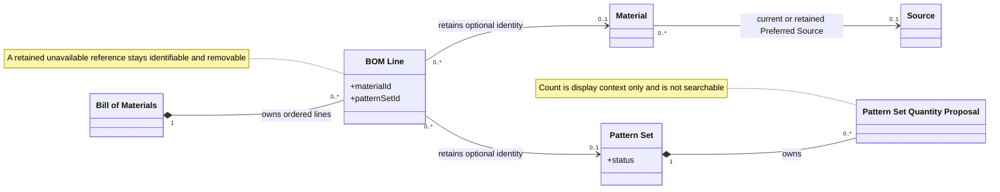
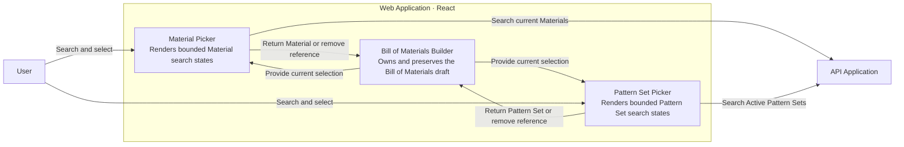
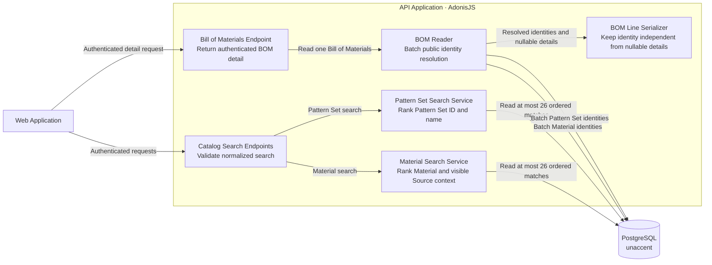
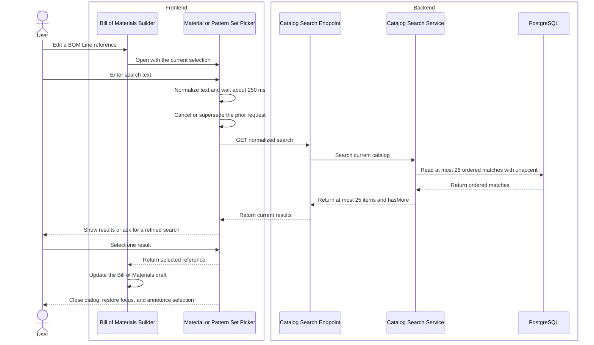
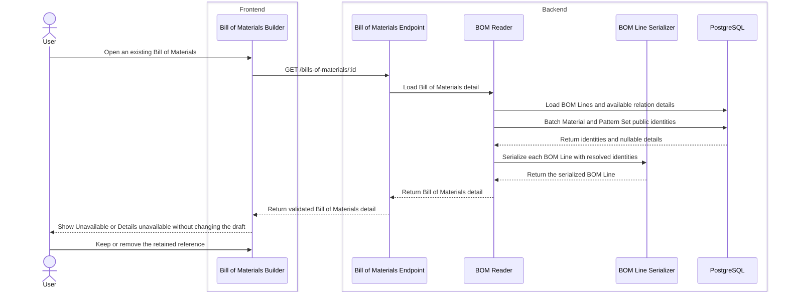

# Dependable Material and Pattern Set Selection

Large-catalog Material and Pattern Set dialogs now preserve the User's Bill of Materials draft during search and recovery. Search is bounded and deterministic. A retained unavailable reference stays visible and removable. This issue does not add pagination or catalog management.

## Bounded and Deterministic Search

An empty search input keeps each dialog idle. The Web Application normalizes case, accents, outer whitespace, and repeated inner whitespace. It sends a search after about 250 milliseconds without an input change. A newer search cancels the prior request when possible. The dialog ignores a late response from a superseded request. When the User clears the input, the dialog returns to the idle state and removes old results.

The [Material search service](apps/api/app/modules/materials/materials_service.ts) applies order-independent AND matching across Material ID, Material name, Material Color, Material Use, and visible Preferred Source context. Visible Source context includes Source ID, name, Vendor, shade or detail, description, and width. A Material identity match ranks above a Source-only match.

The [Pattern Set search service](apps/api/app/modules/pattern_sets/services/pattern_sets_service.ts) matches only Pattern Set ID and name. Pattern Set Quantity Proposal count is display context. It is not a search field.

Both services rank results by exact ID, exact primary name, ID prefix, primary-name prefix, word match, and partial context. Primary name and ID provide deterministic tie-breaks. PostgreSQL `unaccent` provides general diacritic folding. Each service reads at most 26 ordered matches. It returns at most 25 items and a `hasMore` value. The dialogs ask the User to refine a search when more matches exist.

The Web Application can reuse an identical search for 30 seconds in the current session. Material–Source relationship changes and relevant Source update or status changes invalidate Material searches. Pattern Set mutations invalidate Pattern Set searches. One family does not invalidate the other family.

## Draft and Reference Safety

Each BOM Line response returns `materialId` and `patternSetId` independently from the nullable Material and Pattern Set details. The [BOM reader](apps/api/app/modules/bills_of_materials/services/read_bills_of_materials.ts) resolves public identities in two batched reads: one Material read and one Pattern Set read. The internal [BOM Line serializer](apps/api/app/modules/bills_of_materials/services/bill_of_materials_line_serializer.ts) uses these identities and does not dereference a missing relation.

A retained deleted Material shows its name, ID, and **Unavailable**. A retained Retired Pattern Set shows the same clear state. A reference with missing details shows its ID and **Details unavailable**. The User can remove either state. An unchanged retained reference remains saveable.

If a newly selected Material becomes deleted before Save, the API returns a field error for that BOM Line. It does the same when a newly selected Pattern Set becomes Retired. The Bill of Materials Builder keeps the Bill of Materials draft and shows the reason on the affected field.

The [Bill of Materials Builder default-values module](apps/web/src/features/bills-of-materials/bom-builder-default-values.ts) owns the form initialization policy. Editing preserves BOM Line Verification. Copy and application workflows reset verification. New Templates and Implementations receive the correct Product or Product Variant scope. Retained Material and Pattern Set IDs do not depend on expanded details.

## Recoverable and Accessible Dialogs

The current selection stays present during idle, debounce, loading, results, more-matches, empty, recoverable failure, authentication failure, authorization failure, retained-unavailable, and details-unavailable states.

A recoverable search failure offers **Try again**. Authentication and authorization failures do not offer a retry action. A successful selection closes the dialog, returns focus to the trigger, and announces the result. Native controls support Tab, Enter, Space, and Escape. A discreet live region announces loading, result counts, more matches, empty results, failures, selection, and removal.

On a narrow screen, each [Material picker](apps/web/src/features/bills-of-materials/components/material-picker.tsx) and [Pattern Set picker](apps/web/src/features/bills-of-materials/components/pattern-set-picker.tsx) uses a near-full-screen vertical dialog. The workflow and search rules do not change with screen size.

## Architecture Views

These views show only the domain relationships and runtime collaboration changed by Issue 16.

### UML — Domain Relationships

### C4 Level 3 — Web Application

### C4 Level 3 — API Application

### C4 Dynamic — Search and Select

### C4 Dynamic — Load and Preserve a Retained Reference

## Focused Coverage

- Database-backed tests cover normalization, general diacritic folding, order-independent AND matching, stable-ID and name ranking, identity-before-Source ranking, deterministic tie-breaks, active-catalog rules, the 25-item bound, and `hasMore` from the twenty-sixth match.
- Material tests cover Material ID, color, Material Use, and all visible Preferred Source fields. Pattern Set tests cover Pattern Set ID and name matching. The implementation keeps Pattern Set Quantity Proposal count as display context.
- Web tests cover empty-input idle behavior, about-250-millisecond debounce, normalized requests, late-response protection, clearing, and 30-second cache reuse. The search query passes an abort signal, but focused tests do not assert direct request abortion.
- Colocated query tests cover Material relationship invalidation, Source mutation invalidation, Pattern Set invalidation, and isolation between search families.
- API and route tests cover retained deleted Materials, retained Retired Pattern Sets, missing detail fallback, removal, unchanged Save, and field errors for stale new selections.
- Builder default-value unit tests cover existing Templates, existing Implementations, Template copies, Template application, empty Templates, and empty Implementations.
- Dialog tests cover loading, results, more matches, empty results, recoverable failure, authentication failure, authorization failure, retry rules, and draft preservation.
- Accessibility tests cover focus restoration, Tab, Enter, Space, Escape, and selection announcements. The component layout implements the narrow-screen dialog structure, but focused tests do not assert viewport layout.
- The repeatable performance test creates at least 10,000 active records in each catalog and checks each server-response p95 separately from debounce.

## Focused Verification

- Focused API functional tests — 32 of 32 pass.
- Internal BOM Line serializer unit test — 1 of 1 passes.
- Bill of Materials Builder default-value unit tests — 6 of 6 pass.
- Focused Web Application route and query tests — 39 of 39 pass.
- Repeatable 10,000-record catalog performance test — 1 of 1 passes with a p95 threshold of at most 500 milliseconds for each catalog.
- API Application and Web Application typechecks — pass.
- Focused API Application, Web Application, Shared Types, and Shared Validation lint checks — pass.
- Shared Types and Shared Validation build checks — pass.
- Formatting and `git diff --check` — pass.
- Independent Standards review — pass with zero findings.
- Independent Spec review — pass with zero findings.

The complete `pnpm quality` gate did not run. The final quality gate belongs to the User and CI.

## Scope Boundaries

- The dialogs do not add pagination or **Load more**.
- Pattern Set Quantity Proposal count is display-only. It does not affect search matching.
- A deleted Material and a Retired Pattern Set are unavailable for a new selection.
- Retained unavailable history does not return to the active selection catalog.
- This issue does not change Material Quantity, BOM Line Verification, or Pattern Set Quantity Proposal rules.
- This issue does not add catalog management or a Product workspace.
- Search cache data is session-local. It is not shared or persistent.

## Review Closure

The independent Standards review passed with zero findings. The independent Spec review passed with zero findings. No review action remains for Issue 16.

## Remaining Risk

The performance evidence is local. Production concurrency telemetry is not available in this issue.

The deployment PostgreSQL role must be able to enable `unaccent`. Migration rollback leaves the extension installed because another schema or application can share it.

The complete quality gate did not run.

## Commit State

The Issue 16 implementation and this `changes.md` handoff are uncommitted and not pushed. The current `HEAD` is `cb5625d`, the completed Issue 15 commit.

These unrelated dirty paths remain protected and are not part of Issue 16:

- `.gitignore`
- `apps/api/AGENTS.md`
- `apps/web/vite.config.ts`
- `docs/architecture/framework-abstraction-decision.md`
