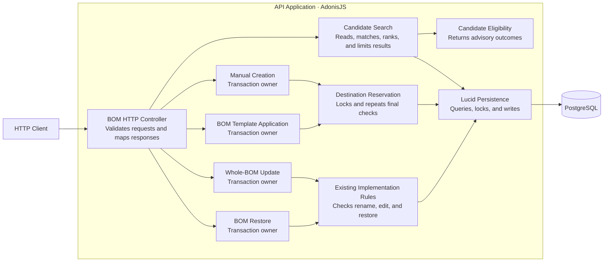
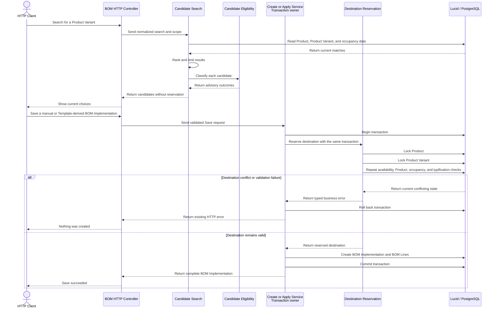

# One Destination Seam for BOM Implementation Rules

Candidate search, manual creation, BOM Template application, rename, and restore now use one focused destination seam. This is a structural refactor. It does not change domain relationships, HTTP contracts, the database schema, or Web Application behavior.

## Advisory Search and Authoritative Reservation

The [destination seam](apps/api/app/modules/bills_of_materials/services/implementation_destination/index.ts) gives each caller a specific operation. Candidate search asks for an advisory eligibility outcome. Manual creation and BOM Template application ask the seam to reserve a destination before they write.

The [candidate search service](apps/api/app/modules/bills_of_materials/services/search_product_variant_candidates.ts) keeps the existing search, ranking, and 25-result limit. It classifies each visible Product Variant in this order:

1. `implementation-exists`
2. `product-unavailable`
3. `variant-inactive`
4. `eligible`

Search does not reserve a Product Variant. An ineligible Product Variant remains a normal search result with its current outcome.

The write service starts and owns the transaction. It passes the same Lucid transaction to destination reservation. The destination seam does not start a nested transaction.

Reservation locks the Product first and the Product Variant second. It then repeats the authoritative checks. The Product and Product Variant must be active and not deleted. A BOM Template application must select a Product Variant that belongs to the BOM Template Product. The Product Variant must not have a non-deleted BOM Implementation. The BOM Typification must be unique, without case sensitivity, across non-deleted BOM Implementations for the Product.

If a check fails, the existing typed business error leaves the transaction. The caller rolls back. No BOM Implementation or BOM Line is created. If all checks pass, the caller creates the complete result and commits once.

## Existing Implementation Rename, Restore, and Lifecycle

The [whole-BOM update service](apps/api/app/modules/bills_of_materials/services/update_bill_of_materials.ts) uses the same Product-scoped BOM Typification rule for rename. A case-insensitive duplicate name is rejected before line or metadata changes. The complete saved BOM Implementation remains unchanged.

An existing BOM Implementation remains editable when its Product or Product Variant is inactive. It becomes read-only when its Product or Product Variant is deleted. These lifecycle rules are separate from the active-record rules for a new destination.

The [restore service](apps/api/app/modules/bills_of_materials/services/delete_and_restore_bill_of_materials.ts) can restore a BOM Implementation when its related Product or Product Variant is deleted. The restored BOM Implementation then remains read-only. Restore uses the same Product-to-Product Variant lock order. It repeats Product Variant occupancy and Product-scoped, case-insensitive BOM Typification checks. Concurrent restore attempts still allow only one valid winner.

## Architecture Views

Domain relationships did not change. Therefore, this walkthrough omits a UML domain relationship view.

### C4 Level 3 — API Application

### C4 Dynamic — Advisory Search and Final Save

## Focused Coverage

These three behavior-characterization cases were added. Each case passed against the baseline implementation, so there was no behavioral red state.

- Manual BOM Implementation creation rejects an inactive Product and persists nothing.
- Direct BOM Template application rejects a Product Variant from another Product and persists nothing.
- Rename rejects a case-insensitive duplicate BOM Typification in the same Product and preserves the complete saved BOM Implementation.

## Focused Verification

- Focused BOM functional tests — 42 of 42 passed, including concurrency and forced rollback coverage.
- API typecheck — passed.
- Full API lint — passed.
- `git diff --check` — passed.
- Standards review — PASS with no findings.
- Spec review — PASS with no findings.

The first focused test attempt could not bind `0.0.0.0:3333` in the sandbox. The same test passed when test access was enabled. This was an environment limit, not a product failure.

The complete `pnpm quality` gate and full repository test suites did not run.

## Scope Boundaries

- Domain relationships did not change.
- HTTP contracts, database schema, and Web Application behavior did not change.
- This refactor does not add new behavior.
- Candidate search remains advisory and does not reserve a destination.
- The destination seam does not own transactions.
- Existing unrelated working-tree changes remain preserved.

## Commit State

The feature is uncommitted and ready for review.
