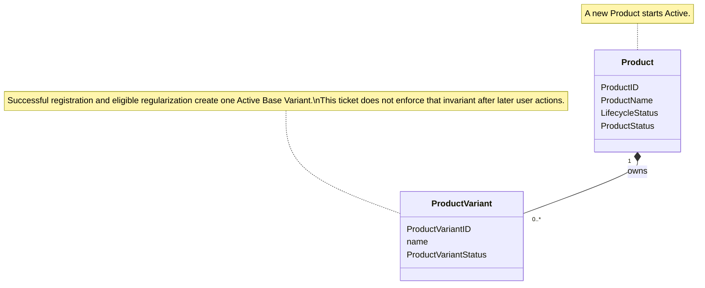
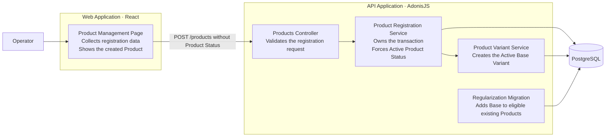
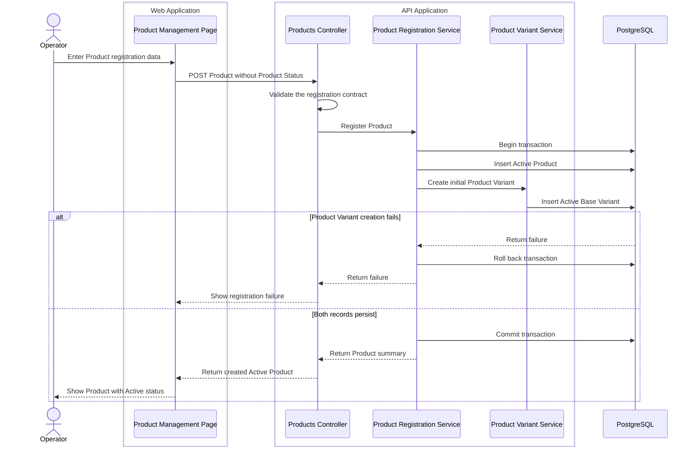
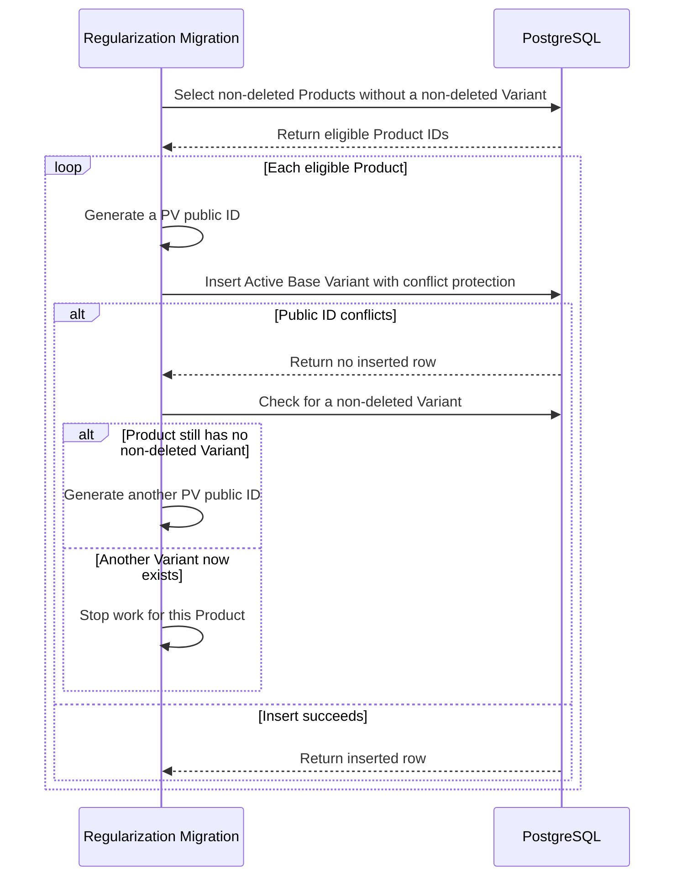

# Products Start with an Active Base Variant

Product registration now creates one Active Product and one owned Active Product Variant named `Base` in one transaction. The Web Application does not let the user select Product Status during registration. A one-way migration gives the same baseline to eligible existing Products. This change does not make `Base` a special Product Variant after creation.

## Atomic Product Registration

The [Product registration service](apps/api/app/modules/products/products_service.ts) always sets Product Status to `Active`. The registration contract no longer accepts Product Status. Existing Lifecycle Status and Collection selection behavior remains available.

The service creates the Product and its initial Product Variant in one database transaction. The [Product Variant service](apps/api/app/modules/products/product_variants_service.ts) gives the initial Variant an established `PV-` public ID, the name `Base`, and Product Variant Status `Active`.

If Product Variant creation fails, the transaction rolls back. The database does not keep a partial Product.

After registration, `Base` is a normal Product Variant. A user can rename it or change its Product Variant Status. It has no special flag, protected name, or link to the Product Name.

## Registration Contract and Form

The [shared type](packages/shared-types/src/index.ts) and [shared validation schema](packages/shared-validation/src/index.ts) no longer include Product Status in the registration request.

The [Product management page](apps/web/src/features/products/product-management-page.tsx) no longer shows a Product Status control in the create form. After a successful request, the new Product appears with Product Status `Active`.

Product Status remains available through the existing Product availability actions after registration.

## Existing Product Regularization

The [regularization migration](apps/api/database/migrations/1789870400000_regularize_product_variants.ts) selects each non-deleted Product that has no non-deleted Product Variant. It creates one Active Product Variant named `Base` for each selected Product.

The migration preserves these records:

- A Product that already has at least one non-deleted Product Variant.
- A deleted Product.
- A soft-deleted Product Variant.

A Product with only soft-deleted Product Variants receives a new non-deleted `Base` Variant. The migration uses the established `PV-` public-ID format. If a generated public ID conflicts, the insert changes no data and the migration tries another ID. A second migration run changes no records when no eligible Product remains.

The migration does not delete its created Product Variants during rollback. Each created `Base` Variant becomes an ordinary user-managed Product Variant immediately. The migration cannot identify it safely after a rename or another user change.

## Architecture Views

### UML — Domain Relationships

### C4 Level 3 — Product Registration

### C4 Dynamic — Atomic Registration

### C4 Dynamic — Existing Product Regularization

## Focused Coverage

The focused tests prove these behaviors:

- Product registration persists one Active Product and one owned Active `Base` Variant.
- Product registration keeps the selected Lifecycle Status and ignores an untrusted Product Status value.
- A failure during initial Product Variant creation leaves no Product.
- The initial `Base` Variant uses the established public-ID format.
- The initial `Base` Variant can be renamed and made inactive as a normal Product Variant.
- The create form omits Product Status from the control and request.
- The created Product row shows Product Status `Active`.
- Downstream Bill of Materials candidate and catalog behavior accepts the new baseline Product Variant.

## Focused Verification

- Product creation functional tests — 12 of 12 passed.
- Product Variant functional tests — 8 of 8 passed.
- Bill of Materials Product relationship functional tests — 11 of 11 passed.
- Bill of Materials catalog functional tests — 6 of 6 passed.
- Product Web route tests — 14 of 14 passed.
- Shared types typecheck — passed.
- Shared validation typecheck — passed.
- API typecheck — passed.
- Web Application typecheck — passed.
- Focused lint checks — passed.
- `git diff --check` — passed.

The complete `pnpm quality` gate did not run.

## Scope Boundaries

- This change establishes the Product Variant baseline during registration and migration. It does not add a database constraint that prevents later deletion of a Product's last non-deleted Product Variant.
- `Base` is not a protected name or a separate Product Variant type.
- This change does not synchronize the Product Variant name with the Product Name.
- Product Status cannot be selected during registration. Existing Product availability actions remain unchanged.
- The migration is a one-way data regularization. Its rollback does not delete user-managed Product Variants.
- The recurring functional suite does not execute the one-way regularization migration. This user-directed exception replaces the original ticket requirement for a database-backed migration test.
- No complete repository test suite ran.
- Existing unrelated working-tree changes remain preserved.

## Commit State

The feature is uncommitted and has not been pushed.
