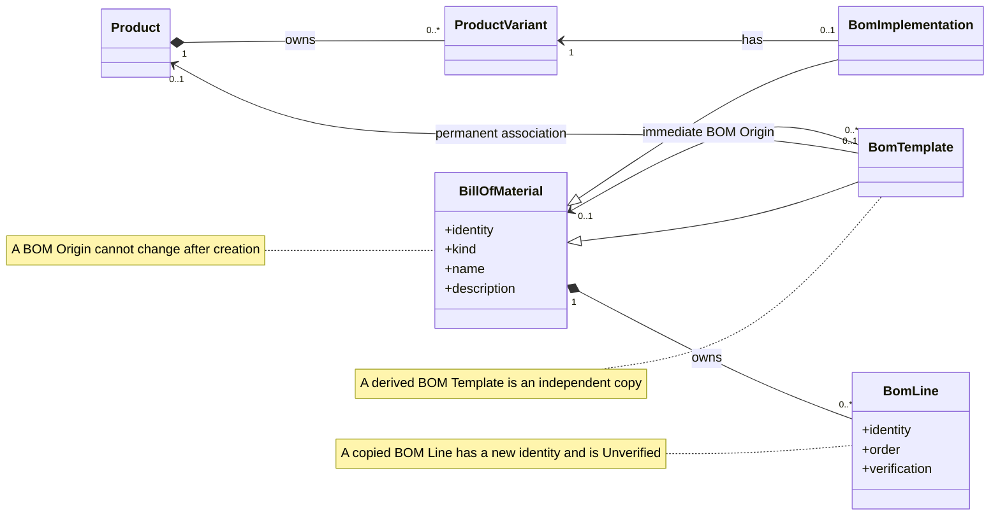
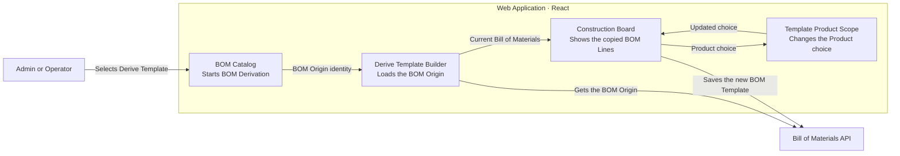
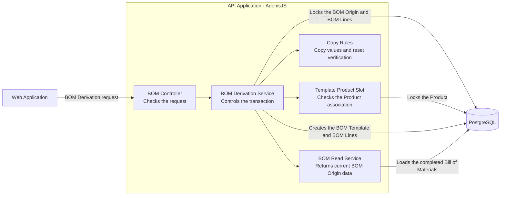

# Derive a New BOM Template from an Existing Bill of Materials

Before this change, a User could apply a BOM Template to a Product Variant. The User could not copy an existing Bill of Materials into a new BOM Template.

This change adds that copy operation. The project calls it **BOM Derivation**. An Admin or Operator can derive a new BOM Template from a non-deleted BOM Template or BOM Implementation. The new BOM Template records its immediate **BOM Origin**, but it does not stay connected to the origin's construction data.

This change does not add inheritance or synchronization. After Save, the origin and the new BOM Template are independent.

## What the User Does

The User starts in the Bill of Materials catalog.

1. Open the actions for a non-deleted BOM Template or BOM Implementation.
2. Select **Derive Template**.
3. Review the copied construction in the Construction Board.
4. Edit the proposed BOM Template name.
5. Keep, remove, or change the proposed Product association.
6. Select **Save BOM**.

The Builder proposes `<BOM Origin name> — copy` as the new name. The User can change this name. BOM Template names do not have to be unique.

The Builder shows the copied BOM Lines before Save. The copied BOM Lines are read-only during this step. If Save fails, the Builder keeps the name, Product choice, and copied BOM Lines. The User can correct the problem and try again.

The [BOM catalog](apps/web/src/features/bills-of-materials/bills-of-materials-catalog-page.tsx) starts the operation. [DeriveTemplateBuilder](apps/web/src/features/bills-of-materials/derive-template-builder.tsx) loads the current Bill of Materials and opens the Construction Board.

## What the System Copies

Save creates one new BOM Template and new BOM Lines in one database transaction.

The system copies these values from the BOM Origin:

- Description.
- Construction Piece.
- Material.
- Material Quantity.
- Pattern Set.
- Line Note.
- BOM Line order.

The system gives the new BOM Template a new identity. It also gives each copied BOM Line a new identity. All copied BOM Lines start with BOM Line Verification set to Unverified.

The system does not change the BOM Origin. A failure during Save removes all new records from the transaction. It does not leave an incomplete BOM Template or an incomplete set of BOM Lines.

The [BOM Derivation service](apps/api/app/modules/bills_of_materials/services/derive_bill_of_materials_template.ts) controls the transaction. The shared [copy rules](apps/api/app/modules/bills_of_materials/services/template_application_snapshot.ts) define the values that the system copies. These rules also reset BOM Line Verification.

## How the Product Association Works

A BOM Template can have a permanent association with one Product. A Product can have no more than one non-deleted BOM Template.

When the BOM Origin has Product context, the Builder proposes that Product for the new BOM Template. For a BOM Implementation, the system gets the Product through its Product Variant.

The User has three choices:

- Keep the proposed Product.
- Remove the Product and create an unassociated BOM Template.
- Select a different eligible Product.

If the proposed Product is Inactive, soft-deleted, or already has a BOM Template, Save still succeeds. The new BOM Template is unassociated.

If the User selects a different Product, that Product must be Active and non-deleted. It must not have another non-deleted BOM Template. If it does not meet these rules, Save fails and the Builder keeps the draft.

The [Template Product scope](apps/web/src/features/bills-of-materials/components/template-product-scope.tsx) lets the User change this choice. The API checks the Product again during Save.

## What BOM Origin Means

A derived BOM Template records one BOM Origin. The BOM Origin is the immediate Bill of Materials that the User copied.

For example:

- The User derives BOM Template B from BOM Template A. The BOM Origin of B is A.
- The User then derives BOM Template C from B. The BOM Origin of C is B, not A.

The system does not store a root, a depth value, a descendant list, BOM Line correspondence, or a historical snapshot. The derivation chain has no artificial depth limit.

The BOM Origin cannot change after creation. A Bill of Materials cannot be its own BOM Origin. The [origin protection migration](apps/api/database/migrations/1789697600000_protect_bill_of_materials_origin.ts) enforces these rules.

The application displays the current name, kind, and availability of the BOM Origin. If a User renames, soft-deletes, or restores the BOM Origin, this displayed information changes. The description and BOM Lines of the derived BOM Template do not change.

A soft-deleted Bill of Materials cannot be used for a new BOM Derivation. Existing derived BOM Templates keep their BOM Origin reference when the origin is soft-deleted.

## Architecture Views

### UML — Domain Relationships

### C4 Level 3 — Web Application

### C4 Level 3 — API Application

### C4 Dynamic — Save a BOM Derivation

```mermaid
sequenceDiagram
    actor User

    box Frontend
        participant Catalog as BOM Catalog
        participant Board as Construction Board
        participant Product as Template Product Scope
    end

    box Backend
        participant API as BOM Controller
        participant Derivation as BOM Derivation Service
        participant Rules as Product and Copy Rules
        participant Database as PostgreSQL
    end

    User->>Catalog: Select Derive Template
    Catalog->>API: Request the current BOM Origin
    API->>Database: Load the Bill of Materials
    Database-->>Board: Return the BOM Origin and BOM Lines
    Board-->>User: Show the proposed copy
    User->>Product: Keep, remove, or change the Product
    Product-->>Board: Set the Product choice
    User->>Board: Edit the name and select Save BOM
    Board->>API: Send the name and Product choice
    API->>Derivation: Start BOM Derivation
    Derivation->>Database: Start transaction and lock the BOM Origin and BOM Lines
    Derivation->>Rules: Check Product and prepare copied values

    alt The request is valid
        Derivation->>Database: Create the BOM Template and new BOM Lines
        Derivation->>Database: Load the completed Bill of Materials
        Database-->>Board: Return the new BOM Template
        Board-->>User: Return to the updated catalog
    else The request fails
        Derivation->>Database: Roll back all new records
        API-->>Board: Return an error
        Board-->>User: Keep the draft visible
    end
```

## What the Tests Prove

The focused tests prove these behaviors:

- A BOM Template or BOM Implementation can be a BOM Origin.
- The new BOM Template and its BOM Lines have new identities.
- The system copies the specified construction values in the correct order.
- Copied BOM Lines start Unverified.
- The User can keep or remove the proposed Product.
- An unavailable proposed Product results in an unassociated BOM Template.
- A different selected Product must meet the existing association rules.
- A derivation chain stores only the immediate BOM Origin.
- The database rejects a self-reference and a later change to BOM Origin.
- The displayed BOM Origin information uses the current name and availability.
- Changes to an origin do not change a derived BOM Template.
- A failed Save keeps the Builder draft.

## Checks That Passed

- Shared types build.
- Shared validation build.
- API TypeScript check.
- Web TypeScript check.
- Two copy-rule unit tests.
- Four isolated issue 13 API functional tests.
- Twenty Bill of Materials route tests.
- Focused API ESLint.
- Focused Web and shared-contract Oxlint.
- Origin protection migration. The migration is complete in development batch 22.
- `git diff --check`.

The combined Bill of Materials functional test file had a separate problem. Thirty-two tests passed. Six later Material tests returned `422` because earlier tests changed shared Material data. All issue 13 tests passed in that run. They also passed in isolated database runs.

The first API test command could not open a local network port in the sandbox. The same focused tests passed when the command had local-port permission.

The complete test suites did not run. `pnpm quality` did not run. The repository reserves that final check for the User and CI.

## What This Change Does Not Do

This change does not add inheritance, synchronization, merge, or refresh-from-origin behavior.

It does not store a root BOM Origin, derivation depth, descendants, BOM Line correspondence, or historical snapshots.

It does not add deleted-record browsing, deletion confirmation, restoration controls, descendant counts, or restoration conflict handling. [Issue 14](.scratch/bill-of-materials-builder/issues/14-delete-and-restore-bills-of-materials.md) owns that work.

The existing `.gitignore` change and `docs/architecture/framework-abstraction-decision.md` are not part of this feature. This work did not change them.
