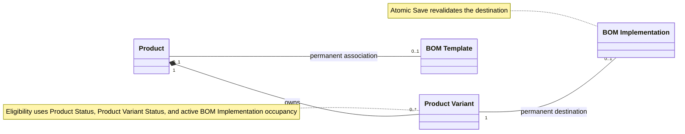
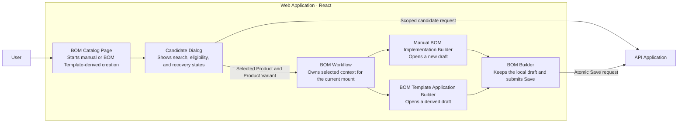
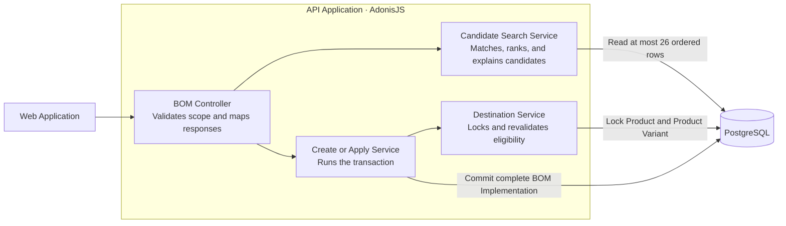
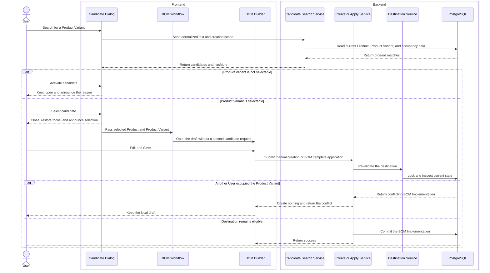

# Reliable Product Variant Candidates for BOM Implementation Creation

Manual and BOM Template-derived creation now use one server-owned Product Variant candidate contract. The contract gives the User current eligibility, stable search order, and conflict-safe Save behavior at catalog scale. This change does not add a Product-page creation workflow or reserve a Product Variant before Save.

## Candidate Scope and Eligibility

The [shared candidate query and response contract](packages/shared-validation/src/bills-of-materials.ts#L332-L384) accepts normalized search text and one optional creation scope.

- Manual creation has no scope and searches all Products.
- Product-context creation supplies one Product ID.
- BOM Template-derived creation supplies one BOM Template ID. The API derives the associated Product.
- A request with both scope identities is invalid.

The [BOM controller candidate action](apps/api/app/modules/bills_of_materials/controllers/bills_of_materials_controller.ts#L93-L110) passes the validated scope to the [candidate search and outcome serializer](apps/api/app/modules/bills_of_materials/services/search_product_variant_candidates.ts#L40-L185). The service composes Product Status, Product Variant Status, and active BOM Implementation occupancy into one result.

Each candidate contains stable Product and Product Variant identity, `selectable`, one outcome, and the existing BOM Implementation identity when the Product Variant is occupied. The outcome precedence is:

1. `implementation-exists`
2. `product-unavailable`
3. `variant-inactive`
4. `eligible`

An in-scope candidate remains visible when it is not selectable. The outcome explains the constraint.

## Deterministic Catalog Search

Search ignores case, accents, and extra whitespace. All terms must match across Product Variant ID, Product Variant Name, Product ID, or Product Name. Term order does not affect matching.

Product Variant relevance controls the primary order. Exact and prefix matches rank before partial matches. A match in Product Variant identity ranks before Product-only context. Eligibility breaks ties only when relevance is equal. Product Variant Name and Product Variant ID provide stable final tie-breaks.

The query reads at most 26 ordered rows. The response returns at most 25 candidates and `hasMore`. It does not calculate a total.

The [performance test setup and assertion](apps/api/tests/functional/catalog_search_performance.spec.ts#L13-L160) creates at least 10,000 active Product Variants and measures the authenticated server response separately from Web Application debounce. The acceptance threshold is p95 at or below 500 milliseconds.

## Selection Preserves the Creation Context

The [candidate dialog state and selection flow](apps/web/src/features/bills-of-materials/components/product-variant-candidate-dialog.tsx#L50-L225) represents idle, loading, background refresh, empty, more-matches, recoverable failure, authentication failure, authorization failure, and ineligible-result states.

An ineligible Product Variant remains operable. Activation keeps the dialog open and announces the canonical reason. Dismissal clears the reason. An eligible selection closes the dialog, restores focus to the trigger, announces the selection, and then continues to the BOM Builder.

The dialog suppresses cached rows while a request is active. This behavior prevents selection from eligibility data that is known to be stale.

The [BOM workflow selection handoff](apps/web/src/features/bills-of-materials/bills-of-materials-workflow.tsx#L55-L142) owns the selected Product and Product Variant context for the current mount. It passes that context to the [manual BOM Implementation Builder](apps/web/src/features/bills-of-materials/builder/implementation-builder.tsx#L5-L18) or the [BOM Template application Builder](apps/web/src/features/bills-of-materials/builder/apply-template-builder.tsx#L8-L51). The Builder does not make a second candidate request.

A direct, reloaded, or stale Builder URL has no trusted selected context. The workflow returns the User to the BOM catalog.

## Candidate Cache Follows Catalog Changes

The [candidate query hook](apps/web/src/features/bills-of-materials/api/bills-of-materials.ts#L139-L169) keys each candidate search by User session, creation scope, and normalized search text. An identical search can reuse data for 30 seconds in the same session.

Product, Product Variant, BOM Implementation, and relevant BOM Template mutations use the [candidate-affecting invalidation boundary](apps/web/src/features/bills-of-materials/api/bills-of-materials.ts#L272-L282). Active candidate results refresh after these mutations. Cached rows remain hidden until the current response arrives.

A `401` candidate response ends the current User session and does not retry. A `403` response remains in the dialog and does not retry. A recoverable server failure preserves the creation context and offers **Try again**.

## Save Remains the Authority

Candidate search gives guidance. It does not reserve a Product Variant.

Manual creation and BOM Template application use the existing atomic Save path. The destination service locks and revalidates the Product, Product Variant, BOM Template scope, and active BOM Implementation occupancy before creation.

If another User occupies the Product Variant first, Save creates no partial BOM Implementation. The response identifies the conflicting BOM Implementation. The BOM Builder keeps the User's BOM Typification and BOM Line draft. The workflow does not select another Product Variant.

## Architecture Views

### UML — Domain Relationships

### C4 Level 3 — Web Application

### C4 Level 3 — API Application

### C4 Dynamic — Search, Select, and Save

## Focused Coverage

- Database-backed API tests cover global, Product, and BOM Template scope; invalid mixed scope; outcome precedence; normalized AND matching; Variant-first ranking; stable tie-breaks; the 25-item bound; and `hasMore`.
- Concurrency tests cover atomic revalidation, active occupancy, no partial creation, conflict identity, and local draft preservation.
- Dialog tests cover request supersession, stale-result suppression, empty and more-matches states, recoverable and authorization failures, session expiry, ineligible activation, focus restoration, and live announcements.
- Query tests cover 30-second same-session reuse, session separation, and invalidation after candidate-affecting mutations.
- Route tests cover manual and BOM Template-derived selection, no second candidate request, and safe recovery from missing selected context.
- The performance test covers at least 10,000 active Product Variants.

## Focused Verification

- Earlier focused API tests — 24 of 24 passed.
- Product relationship tests — 11 of 11 passed.
- Performance test with 10,000 active Product Variants — 1 of 1 passed. The test asserts server-response p95 at or below 500 milliseconds.
- API typecheck, focused lint, focused formatting, and `git diff --check` — passed.
- Affected Web Application tests — 70 of 70 passed.
- Candidate dialog, cache, and BOM route tests — 49 of 49 passed.
- Final candidate dialog and BOM route tests — 45 of 45 passed.
- Web Application typecheck, focused lint, focused formatting, and `git diff --check` — passed.
- Independent Standards review — zero findings.
- Independent Spec review — zero findings.

The complete `pnpm quality` gate did not run. This is an environment boundary, not a focused product failure.

## Scope Boundaries

- Candidate search does not reserve a Product Variant.
- The response contains at most 25 candidates and `hasMore`. It does not add a total, pagination, incremental loading, or virtualization.
- Ranking does not use recency or personalization.
- The cache is limited to one User session and a 30-second fresh window.
- Selected candidate context is limited to the current mounted workflow.
- An occupancy conflict does not cause automatic reassignment.
- This change does not add a Product-page creation workflow.
