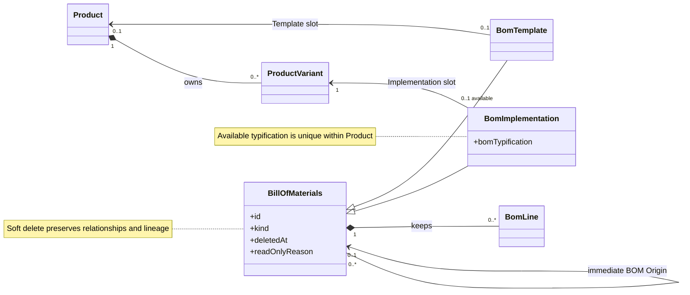
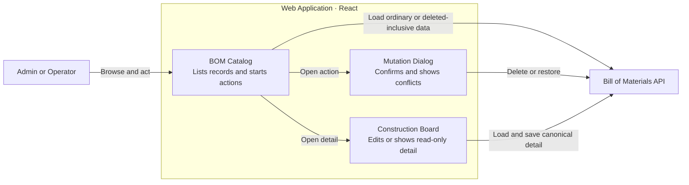
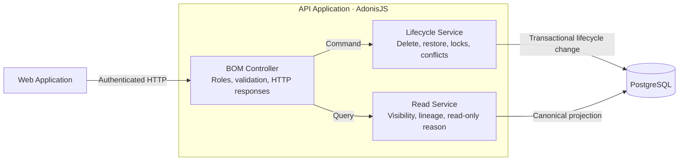
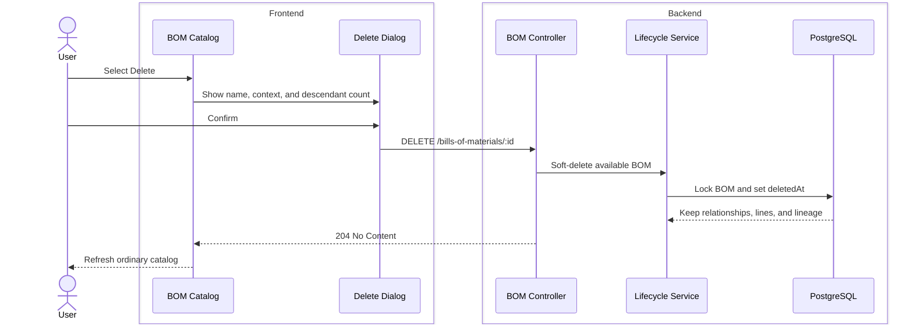
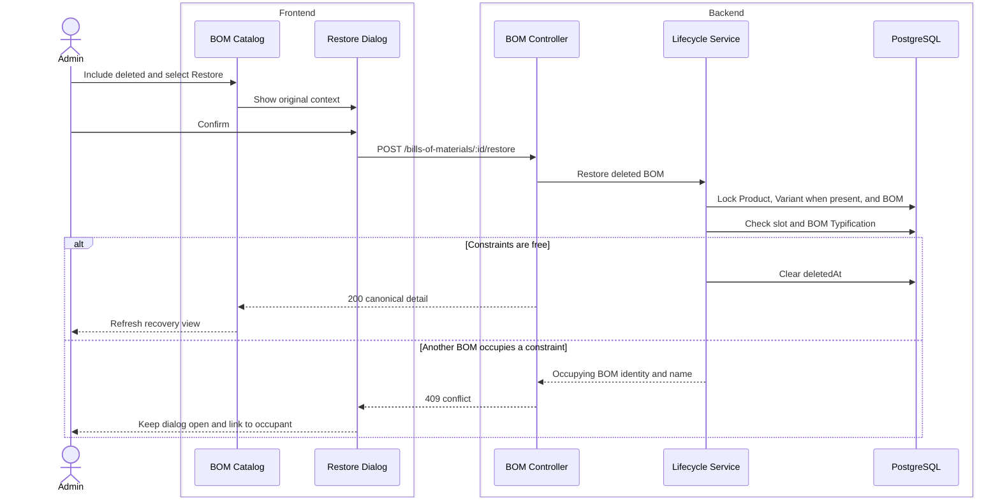

# Delete and Restore Bills of Materials Without Losing History

Issue 14 adds a safe way to remove a Bill of Materials from ordinary work and restore it later. Delete frees the available Product or Product Variant slot. It does not erase the Bill of Materials, its BOM Lines, or its BOM Origin history. This change does not hard-delete or move any record.

## Start Here

A Product can have one available BOM Template. A Product Variant can have one available BOM Implementation. A BOM Implementation also has a BOM Typification that must be unique within its Product.

Before this change, a User could not free one of these slots without losing the normal workflow. Now an Admin or Operator can soft-delete the Bill of Materials. An Admin can restore it when the original slot and name rules are available again.

The completed requirements are in [Issue 14](.scratch/bill-of-materials-builder/issues/14-delete-and-restore-bills-of-materials.md).

## Delete Frees a Slot but Preserves the Record

Delete is a lifecycle change, not erasure.

- The Bill of Materials leaves the ordinary catalog.
- Its Product or Product Variant slot becomes available.
- Its Product, Product Variant, BOM Origin, and BOM Line relationships stay unchanged.
- Its descendants stay available. They continue to identify the deleted record as their unavailable BOM Origin.
- The confirmation shows the Bill of Materials context and the full descendant count before the User continues.

The [lifecycle service](apps/api/app/modules/bills_of_materials/services/delete_and_restore_bill_of_materials.ts) owns the transaction and row lock. The [read service](apps/api/app/modules/bills_of_materials/services/read_bills_of_materials.ts) owns deleted-record visibility, transitive descendant counts, and read-only reasons.

## Restore Rechecks the Original Business Rules

Only an Admin can restore a Bill of Materials. Restore does not bypass the rules that protect Product structure.

- A BOM Template can return only when its Product Template slot is free.
- A BOM Implementation can return only when its Product Variant slot is free.
- Its BOM Typification must still be unique within the Product. Matching is case-insensitive.
- Inactive or soft-deleted related Product records do not block restore.
- A conflict changes neither Bill of Materials. The response identifies the occupying record.

Restore locks the Product before the Product Variant. It then locks the deleted Bill of Materials and checks every constraint in the same transaction. The [controller](apps/api/app/modules/bills_of_materials/controllers/bills_of_materials_controller.ts) validates the conflict response with the shared Zod contract before it returns `409`.

## Catalog and Construction Board Behavior

The ordinary catalog excludes deleted Bills of Materials. An Admin can select **Include deleted** to see recovery records. An Operator cannot list or open a deleted record.

The [mutation dialog](apps/web/src/features/bills-of-materials/components/bill-of-materials-mutation-dialog.tsx) gives the User enough context before Delete or Restore. If restore has a conflict, the dialog links to the occupying Bill of Materials.

The [Construction Board](apps/web/src/features/bills-of-materials/create-bom-template-page.tsx) uses the server-owned `readOnlyReason`:

- `bom-deleted` for a deleted Bill of Materials.
- `product-deleted` when its Product is deleted.
- `product-variant-deleted` when its Product Variant is deleted.

These states lock every edit control. An Inactive Product or Product Variant stays editable. If another User deletes an open Bill of Materials, the later Save returns `409`; the local draft stays visible and the application does not restore the record.

## Architecture Views

The views below show only the domain relationships and runtime collaboration changed by Issue 14.

### UML — Domain Relationships

### C4 Level 3 — Web Application

### C4 Level 3 — API Application

### C4 Dynamic — Delete a Bill of Materials

### C4 Dynamic — Restore a Bill of Materials

## Focused Coverage

The focused tests prove these behaviors through the API and visible Builder seams:

- Soft delete releases the slot and preserves BOM Lines and BOM Origin lineage.
- Descendant counts include the full available and deleted Origin chain.
- Admin and Operator permissions differ for deleted lists, detail, and Restore.
- Restore protects Template slots, Implementation slots, and Product-scoped BOM Typification.
- Concurrent restore and association operations produce one valid winner without partial mutation.
- Inactive related records stay editable. Soft-deleted related records reject Save without data changes.
- Every Builder mutation control is locked for each read-only reason.
- A Save after concurrent deletion preserves the local draft and does not restore the record.
- Invalid conflict data does not create an unsafe occupying-record link.

The main API coverage is in [bills_of_materials.spec.ts](apps/api/tests/functional/bills_of_materials/bills_of_materials.spec.ts). The catalog and Builder coverage is in [-bills-of-materials.test.tsx](apps/web/src/routes/-bills-of-materials.test.tsx) and [endpoints.test.ts](apps/web/src/features/bills-of-materials/api/endpoints.test.ts).

## Focused Verification

- First red test — Delete returned `404` instead of the required `204`.
- Exact AdonisJS functional cases for Delete, transitive lineage, Admin recovery, Product and Product Variant read-only behavior, and concurrent BOM Typification restore — pass individually.
- Direct Vitest run for `src/routes/-bills-of-materials.test.tsx` — 26 of 26 pass.
- Direct Vitest run for `src/features/bills-of-materials/api/endpoints.test.ts` — the same-origin `includeDeleted` case passes.
- Shared Types and Shared Validation builds, typechecks, and linters — pass.
- API and Web typechecks and linters — pass.
- `git diff --check` and Mermaid heading/fence structure checks — pass.

An earlier combined run of the BOM API file reported 40 passing and seven failing tests. All Issue 14 tests in that run passed. The seven failures are existing Material-line fixture cases that return `422` instead of `201`; they were present before this implementation. The complete API file did not run again after the last focused tests were added.

One earlier Web test command expanded to 103 tests; all 103 passed. The final direct route run is the focused 26-of-26 result above.

The complete repository suites and `pnpm quality` did not run. The final quality gate belongs to the User and CI.

## Scope Boundaries

- No Bill of Materials is hard-deleted.
- Delete does not cascade to BOM Lines, descendants, Products, Product Variants, Materials, Sources, or Pattern Sets.
- Restore does not restore a related Product or Product Variant.
- Restore does not move a Bill of Materials or change its permanent relationships.
- Issue 14 is marked `done`; all acceptance items are checked.
- The existing `.gitignore` change and `docs/architecture/framework-abstraction-decision.md` are unrelated and remain unchanged.
