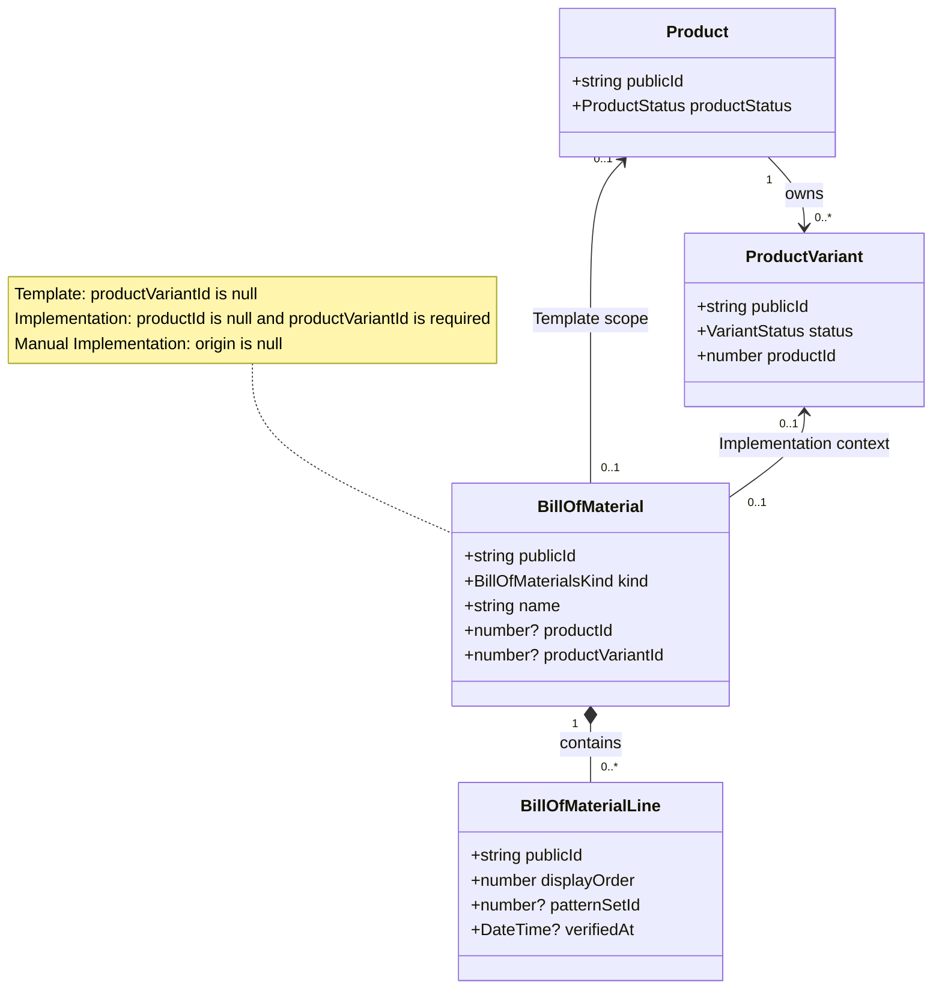
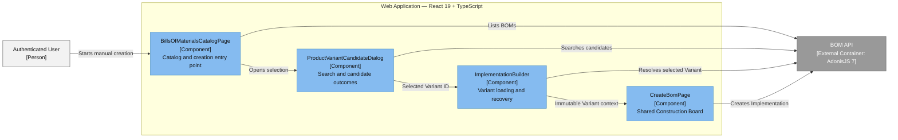
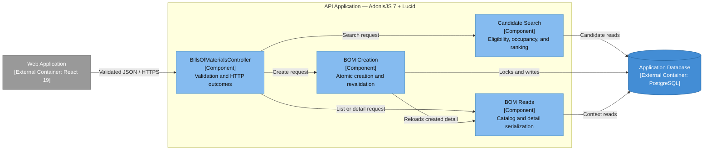
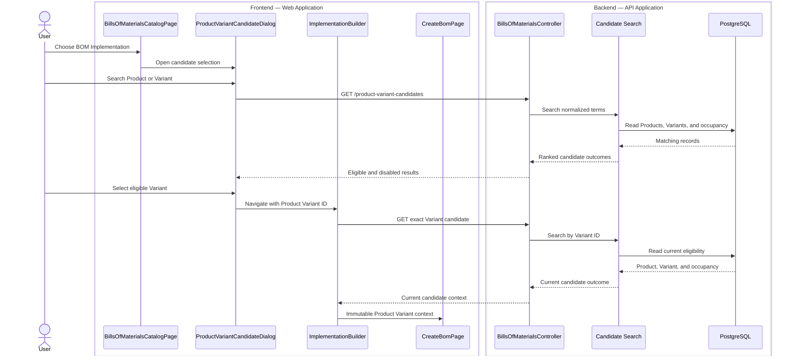
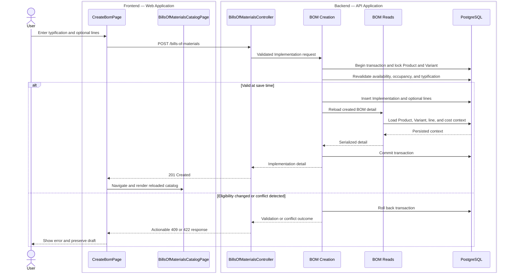

# Create Manual BOM Implementations

Users can now create a concrete BOM Implementation by selecting an eligible Product Variant before entering the shared Construction Board. The Variant remains fixed commercial context while BOM Typification is entered separately; this slice creates manual Implementations only and does not derive them from Templates.

## Product Variant Selection

The Create BOM menu now exposes the Implementation path and opens a remotely searched Product Variant dialog before the Builder. The server composes Product and Variant availability with BOM-owned occupancy, returning eligible matches alongside in-scope unavailable matches with one canonical reason. Occupied candidates identify the existing Implementation instead of disappearing from the result set.

The selected Variant ID travels in route state and is resolved again before the Builder renders. An Implementation route without that required Variant context returns to the catalog instead of silently opening the Template Builder. The Construction Board shows the current Product and Product Variant as fixed context, while the catalog keeps each Product and Variant ID beside its name without a redundant availability label.

## Atomic Manual Creation

The shared BOM contract now discriminates Template and Implementation creation. Implementations require a Product Variant and a manually assigned BOM Typification, store no duplicate Product relationship, and expose no BOM Origin for manual creation.

Creation runs in one transaction. It locks the owning Product and selected Variant, revalidates both availability states, checks Variant occupancy, and serializes Product-scoped typification checks. A database relationship constraint and unique Variant index provide an additional one-Implementation-per-Variant boundary. Typification matching is case-insensitive within one Product and remains reusable across different Products. Candidate contracts encode selectable, unavailable, and occupied outcomes as valid combinations, including the required existing Implementation identity only for occupied Variants.

The existing line pipeline is shared by both BOM kinds, so a manual Implementation may be saved with no lines or with Incomplete and Unverified lines while retaining Material, Pattern Set, verification, attention, and live cost-projection behavior. Save conflicts leave the Builder mounted and preserve the local draft for correction or retry.

## Architecture Views

### UML — Domain Relationships

The optional Product and Product Variant relationships are mutually exclusive by BOM kind. For an Implementation, the Product is reached through its immutable Product Variant rather than stored as a second editable relationship.

### C4 Level 3 — Web Application

Only renderable React components appear inside the Web container. Query hooks, endpoint clients, route state, and shared schemas are expressed through component responsibilities and relationship labels rather than modeled as UI components.

### C4 Level 3 — API Application

### C4 Dynamic — Candidate Selection

Unavailable and occupied candidates remain visible in the dialog but cannot advance to the Builder. A missing or stale Variant context returns the User to the catalog or a recovery state.

### C4 Dynamic — Atomic Save

The save path rechecks mutable eligibility inside the transaction. Any failure rolls back the full write and leaves the local Construction Board draft available for correction or retry.

## Focused Coverage

API acceptance coverage proves manual origin absence, immutable Product/Variant projection on creation and catalog reload, canonical candidate eligibility and precedence, Product-local typification uniqueness, cross-Product reuse, concurrent Variant occupancy, atomic availability rejection, progressive Incomplete saves, and authenticated access.

Builder-route coverage proves the required candidate dialog, visible disabled occupied candidates with existing Implementation identity, fixed Variant context, separate BOM Typification input, conflict recovery without draft loss, save retry, and catalog Variant display. Existing Material and Pattern Set selector coverage verifies that consolidating the common normalized debounce behavior preserved those workflows.

## Focused Verification

- Six issue-specific API functional tests — passed independently, including save-then-index reload of an Implementation.
- Post-review candidate-contract and save-then-index API regressions — 1 passed each; BOM route file — 15 passed.
- Focused BOM API functional file — 22 passed; 2 pre-existing ordered-fixture failures remain in live Material Source scenarios unrelated to this slice.
- Bills of Materials, Materials, and Pattern Sets route files — 34 tests passed.
- API and web lint and TypeScript checks — passed.
- Shared types and shared validation lint and TypeScript checks — passed.
- Development migration and migration status — applied successfully and reported complete.
- Scoped formatting and `git diff --check` — passed.

## Scope Boundaries

This slice does not derive an Implementation from a Template, edit an existing BOM, add soft deletion or restoration, or introduce BOM Origin persistence; those remain with subsequent tracker issues. Complete repository test suites and `pnpm quality` were intentionally not run because the repository reserves the final quality gate for the human and CI.
