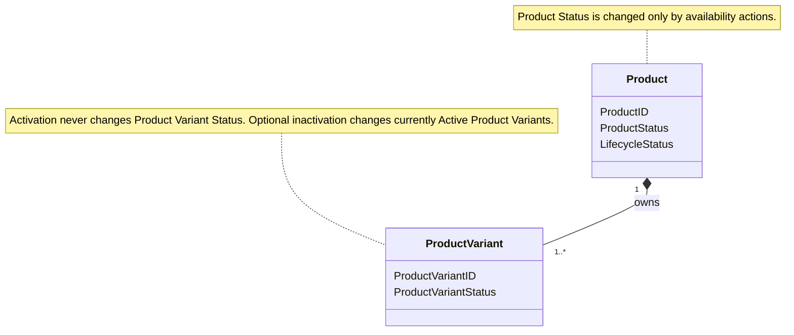
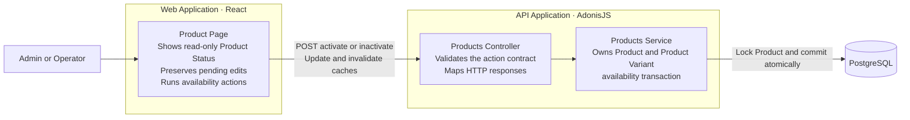
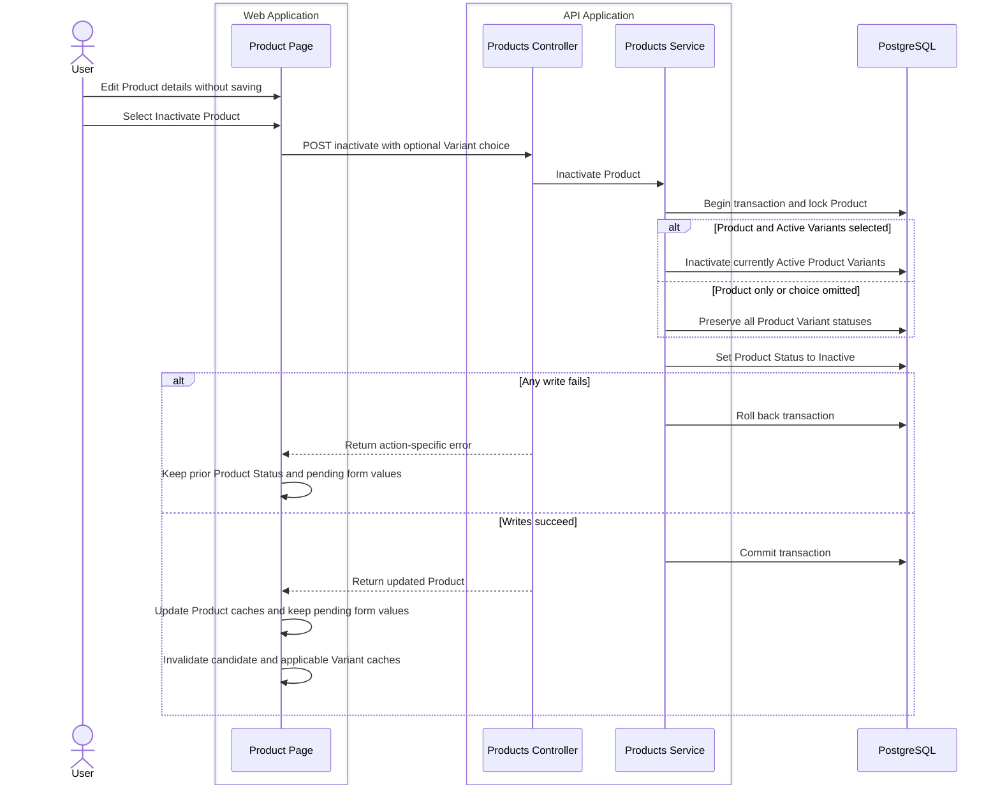

# Product Availability Is an Independent Product-Page Action

Admin and Operator users can now activate or inactivate a Product without saving or discarding pending Product-detail edits. Product Status is read-only record metadata, Product-detail updates no longer own it, and Product availability remains independent from Product Variant availability.

## Dedicated Availability Contracts

The [shared Product contracts](packages/shared-types/src/index.ts) and [shared Product schemas](packages/shared-validation/src/index.ts) remove Product Status from `UpdateProductRequest`. The inactivation contract adds the optional `inactivateVariants` choice. An omitted choice means Product-only inactivation.

The [Product routes](apps/api/start/routes.ts) expose authenticated `activate` and `inactivate` actions. The [Product controller](apps/api/app/modules/products/controllers/products_controller.ts) validates the inactivation choice and maps missing or deleted Products to HTTP `404`. Admin and Operator users can use both actions through the existing bearer-authenticated route group.

## Atomic Product Availability

The [Product service](apps/api/app/modules/products/products_service.ts) runs each availability action in a database transaction. Inactivation locks the Product before it reads or changes Product Variant state. Product-only inactivation preserves all Product Variant statuses. Product-and-Variant inactivation changes only Product Variants that are Active when the transaction runs. A failure rolls back both the Product and Product Variant writes.

Activation changes only Product Status to Active. It does not activate Product Variants, including when all Product Variants are Inactive. Repeated activation and inactivation requests are safe and do not broaden the selected effect.

## Independent Product-Page Workflow

The [Product page](apps/web/src/features/products/product-edit-page.tsx) removes the Product Status field from the edit form and shows the current status in Record metadata. The page header shows the valid `Activate Product` or `Inactivate Product` action. The focused [Product availability action](apps/web/src/features/products/components/product-availability-action.tsx) owns the dialog and action feedback while the page keeps the Product API mutation state. Its scope choice uses the shared shadcn/ui [Radio Group](apps/web/src/components/ui/radio-group.tsx) primitive.

Inactivation opens one dialog. Product-only is the default when an Active Product Variant exists. The user can instead inactivate the Product and every currently Active Product Variant. When no Product Variant is Active, the dialog shows only Product confirmation. Activation runs directly without a dialog.

Availability pending, success, and error feedback is separate from Product-detail save feedback. The action does not submit or reset the React Hook Form state. Pending field values and the dirty state remain after successful and failed availability actions.

The [Product API adapters](apps/web/src/features/products/api/endpoints.ts) call the dedicated actions. The [Product Query hooks](apps/web/src/features/products/api/products.ts) update Product detail and Product list caches from the action response. Every availability action invalidates Product Variant candidate results. Product-and-Variant inactivation also invalidates the Product Variant lists. The [Product query keys](apps/web/src/features/products/query-keys.ts) keep this invalidation scoped to the selected Product.

## Architecture Views

### UML — Domain Relationships

### C4 Level 3 — Product Availability

### C4 Dynamic — Product Inactivation

## Focused Coverage

The focused tests prove these behaviors:

- Omitting the inactivation choice changes only Product Status and preserves the Active `Base` Product Variant.
- Product-and-Variant inactivation changes every currently Active Product Variant and leaves Inactive Product Variants unchanged.
- Activation changes only the Product and succeeds when all Product Variants are Inactive.
- Repeated transitions are idempotent and do not broaden a later Product-only choice.
- Both availability actions require authentication, and Admin and Operator users can use them.
- A forced Product write failure rolls back preceding Product Variant changes.
- A concurrent Product-locked Product Variant creation completes before a blocked bulk inactivation, and the inactivation evaluates the then-current Variant set and inactivates the newly Active Product Variant.
- Product-detail updates cannot change Product Status.
- The Product page shows Product Status as metadata and exposes the status-aware header action.
- The inactivation dialog defaults to Product-only, supports the Product-and-Variant choice, and omits Variant choices when none are Active.
- Pending, success, and error states are visible and action-specific.
- Availability success and failure preserve unsaved form values and the dirty state without sending a Product-detail update.
- Cache behavior refreshes Product Variant candidates for every availability action and Product Variant lists after bulk inactivation.

## Focused Verification

- API Product create and availability tests — 17/17 passed before review remediation; the affected Product availability tests were rerun after remediation — 7/7 passed.
- Product route tests — 16/16 passed.
- Product cache/query tests — 3/3 passed.
- Shared Types, Shared Validation, API, and Web TypeScript checks — passed before review remediation; the affected API and Web TypeScript checks were rerun after remediation — passed.
- Focused API ESLint — passed; focused web and shared-package Oxlint — passed.
- `changes.md` Prettier check through the installed package path — passed.
- `git diff --check` — passed.

Verification limits: Product route tests emitted pre-existing, non-failing React `act(...)` warnings. The root Prettier executable was unavailable during implementation. These limits did not indicate a Product availability failure.

## Scope Boundaries

- Product-table availability actions remain outside this issue.
- Product Variant edit and delete workflows are unchanged.
- Activation does not remember or restore a previous Product Variant status set.
- Inactivation does not support selection of individual Product Variants.
- Deleted Product visibility and restoration permissions are unchanged.
- The complete `pnpm quality` gate did not run.
- Existing unrelated working-tree changes remain preserved.

## Commit State

The feature is uncommitted and has not been pushed.
