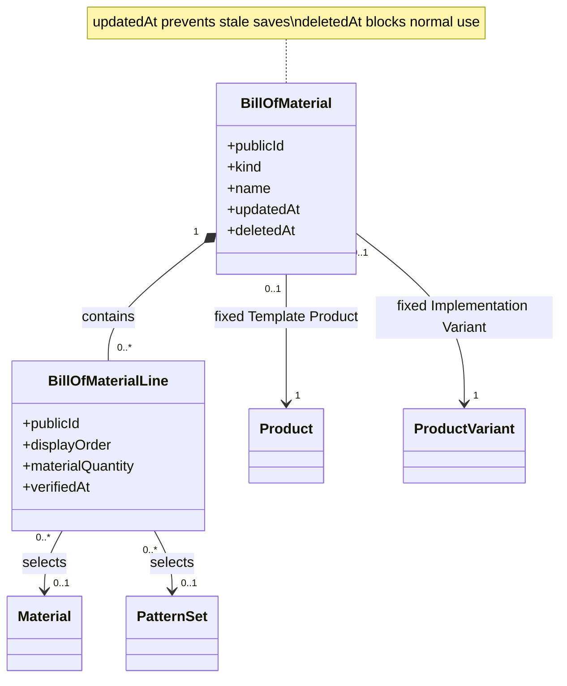
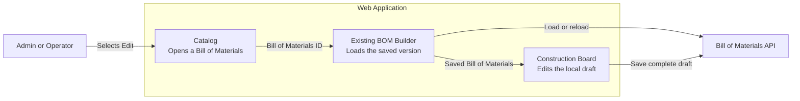
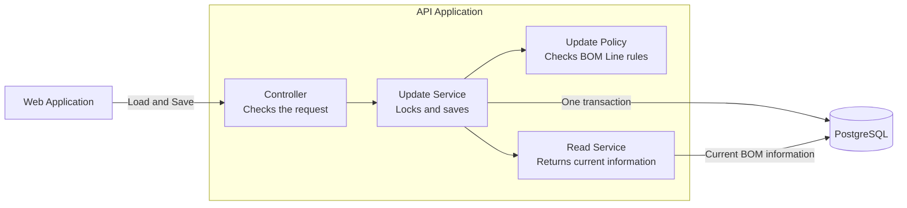
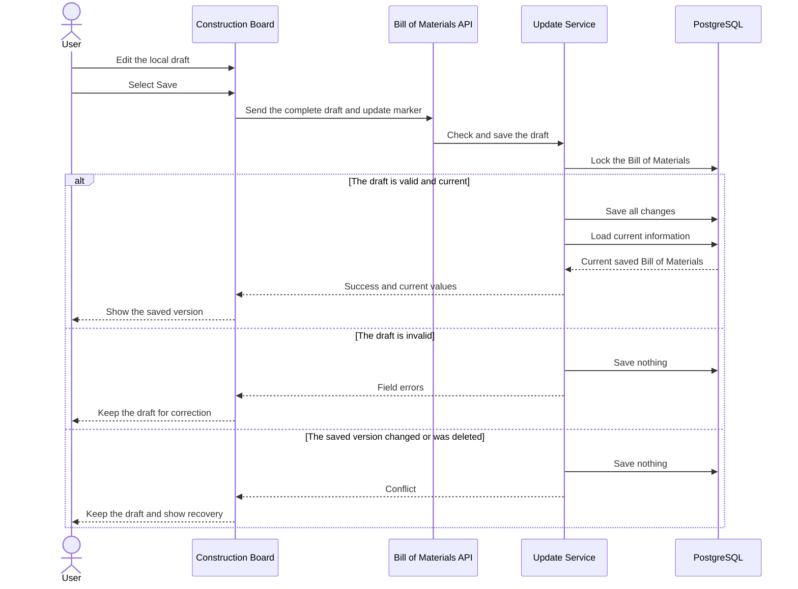

# Edit a Whole Bill of Materials Safely

An Admin or Operator can now edit an existing BOM Template or BOM Implementation. The User edits it in the same Construction Board used for creation. One Save applies the complete draft. This work does not add BOM Derivation, deletion, or restoration.

## What the User Can Do

The catalog now has an Edit action for each available Bill of Materials. The action opens the saved Bill of Materials in the Construction Board.

The User can change:

- The name or BOM Typification
- The description
- BOM Lines
- Construction Pieces
- Materials and Material Quantities
- Pattern Sets
- Line Notes
- BOM Line order
- BOM Line Verification

The User can add, copy, move, and remove BOM Lines. A removed line stays in the local draft until the User selects Save.

Some information stays fixed. The User cannot change the Bill of Materials ID, kind, BOM Origin, Created By, or Created At. The Product of a BOM Template also stays fixed. The Product Variant of a BOM Implementation stays fixed.

## What Happens When the User Leaves

The Construction Board keeps changes in a local draft. It does not save each field separately.

If the User tries to leave with unsaved changes, the app shows two choices:

- Continue editing
- Discard the draft

The browser also warns the User before it closes or reloads a page with unsaved changes.

## What Happens During Save

The API receives the complete draft and the update marker from the loaded Bill of Materials. It checks the marker before it changes any data.

The API then checks:

- The Bill of Materials still exists and is not deleted.
- No other Save changed it after the User opened it.
- Each saved BOM Line belongs to this Bill of Materials.
- A BOM Line ID does not occur twice.
- New Material and Pattern Set selections are available.
- A changed BOM Typification is available for the Product.

The API locks the Bill of Materials, its BOM Lines, and the selected catalog records during these checks.

If a check fails, the API saves nothing. The previous saved version stays unchanged. The Construction Board keeps the local draft so the User can correct it.

If all checks pass, the API applies all changes in one database transaction. It adds new lines, updates retained lines, changes their order, and permanently deletes removed lines.

## Concurrent Changes

Each successful Save changes the server-owned update marker. A Product assignment also changes this marker.

If two Users save the same Bill of Materials, the first valid Save succeeds. The second Save gets a conflict. The second Save cannot write part of its draft.

The Construction Board keeps the second User's draft. It also offers an action to reload the current saved version.

If another User deleted the Bill of Materials, Save also stops. The draft stays visible, but the app does not offer reload because the normal detail is no longer available. Save never restores a deleted Bill of Materials.

## Retained References and Current Information

An existing BOM Line can keep a deleted Material or a Retired Pattern Set. The User can also remove or replace that reference. The User cannot add a new unavailable reference.

Changes to a Material, Source, Landed Unit Cost, or Pattern Set do not change the Bill of Materials update marker. These values are current catalog information, not saved Bill of Materials history.

After Save, the API returns the current saved Bill of Materials. The Construction Board replaces its local preview with these current values. This includes the current BOM Cost Projection and attention conditions.

## BOM Line Verification

The API records the current Operator and verification time.

An unchanged verified BOM Line keeps its evidence. A change to its Construction Piece, Material, or Material Quantity requires new evidence. Changes to its Pattern Set, Line Note, or order do not reset verification. Changes to the Bill of Materials name or description also do not reset verification.

## Responsibilities

- Shared schemas define the create and update request formats.
- The update policy checks line identity, retained references, and verification changes.
- The update service owns database locks, the transaction, and the update marker.
- The Builder persistence hook owns Save, API errors, and navigation protection.
- The Construction Board owns the visible editing experience.

## Architecture Views

### UML — Domain Relationships

### C4 Level 3 — Web Application

### C4 Level 3 — API Application

### C4 Dynamic — Save and Recovery

## Focused Coverage

The API tests prove these behaviors:

- A complete BOM Template update
- A complete BOM Implementation update
- BOM Line addition, removal, and order changes
- Immutable Product and Product Variant relationships
- Complete rollback after a validation error
- Retained unavailable Material and Pattern Set references
- First-Save-wins concurrent updates
- A conflict after deletion

The Construction Board tests prove these behaviors:

- The User can open and edit both Bill of Materials kinds.
- The request contains only editable fields.
- Navigation protection keeps or discards the draft as selected.
- Stale and deleted conflicts keep the draft.
- Reload replaces a stale draft with the current saved version.
- A successful Save replaces previews with current projections.

## Focused Verification

- Six issue-specific API functional scenarios passed.
- Three update-policy unit tests passed.
- Eighteen Bill of Materials route tests passed.
- API and web TypeScript checks passed.
- Focused API ESLint and web Oxlint checks passed.
- Shared type and validation builds and lint checks passed.
- The development migration completed successfully.
- Formatting and `git diff --check` passed.

## Scope Boundaries

This work adds the storage and checks needed to detect a deleted Bill of Materials. It does not add the delete, deleted-record list, or restore actions. Issue 14 owns those actions.

This work does not create a BOM Implementation from a BOM Template. Issue 12 owns BOM Derivation.

This work does not add Updated By, version history, BOM Line audit records, or automatic conflict merging.

The complete test suites and `pnpm quality` did not run. The repository reserves that final check for the User and CI.
