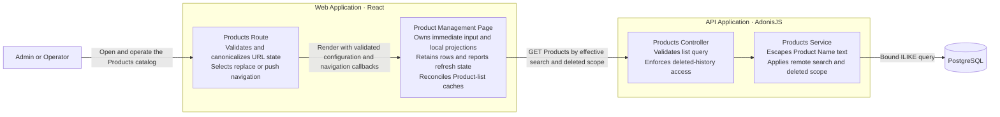
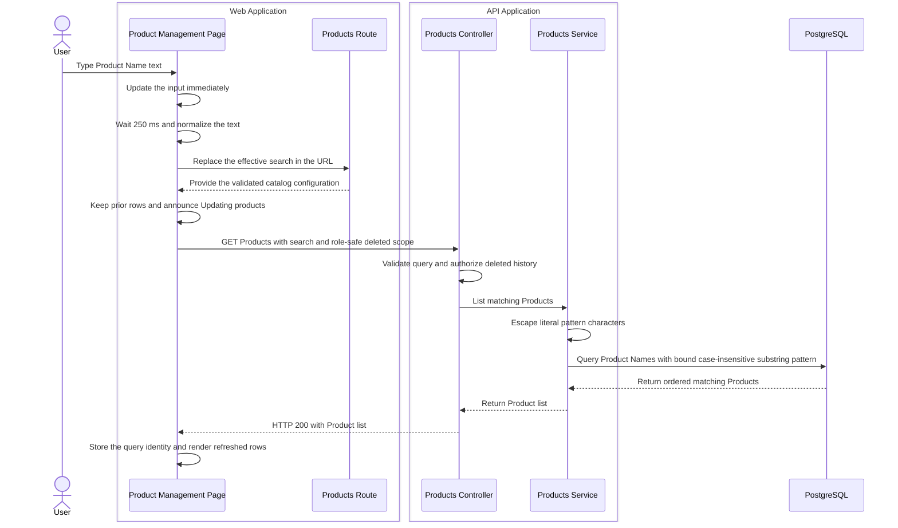

# Product Search Is Remote and Catalog State Is Durable

Admin and Operator users can now search Product Names through the Products endpoint and restore the complete catalog configuration from the route URL. The Products catalog keeps prior rows visible during a debounced refresh, preserves meaningful browser history, and keeps cached Product lists correct after mutations. This slice does not change the approved filter controls, and Lifecycle Status, Product Status, Product Category, and Collection continue to filter locally over the server result.

## Validated Product Search

The Product-domain [shared query contract](packages/shared-types/src/products.ts) and [validation schema](packages/shared-validation/src/products.ts) define the optional Product Name search and Include deleted inputs. The schema rejects blank search text, search text longer than 200 characters, and malformed Include deleted values.

The [Products controller](apps/api/app/modules/products/controllers/products_controller.ts) validates every list request before it calls the service. Invalid catalog parameters return HTTP `422`. An Operator who explicitly requests deleted Products receives HTTP `403`; an Admin can include them.

The [Products service](apps/api/app/modules/products/products_service.ts) applies a bound, partial, case-insensitive Product Name match. It escapes `!`, `%`, and `_`, so these characters remain literal Product Name text and do not become SQL pattern operators. The service applies Product Name search and Include deleted together before it loads the ordered Product result.

## Durable Catalog Configuration

The [Products route](apps/web/src/routes/app.products.tsx) validates Product Name search, Lifecycle Status, Product Status, Product Category, Collection, and Include deleted from the URL. It converts valid Collection identifiers to numbers, removes default values, and canonicalizes invalid values to the safe catalog defaults.

The [Products index route](apps/web/src/routes/app.products.index.tsx) owns navigation changes and passes the validated configuration to the [Product management page](apps/web/src/features/products/product-management-page.tsx). The search input updates immediately. After 250 ms, its normalized value becomes the effective remote search and replaces the current browser-history entry. Discrete filter add, edit, remove, and Clear operations push complete configurations, so Back and Forward restore the full catalog state.

The Product management page sends only the effective Product Name search and role-safe Include deleted value to the endpoint. Lifecycle Status, Product Status, Product Category, and Collection remain local projections of the returned Products. An Operator cannot send Include deleted from a copied URL because the page removes that parameter before the Product request.

The [Product endpoint adapter](apps/web/src/features/products/api/endpoints.ts) serializes the effective remote query and preserves the HTTP status on failures. The Product management page uses this status to keep authentication failure separate from permission failure. A `401` shows an expired-session action. A `403` explains the permission failure and provides Clear all, which restores the safe URL configuration and retries the safe catalog request.

During a debounced request, the page keeps the previous rows and exposes an accessible `Updating products…` status. Search and filter controls remain available when no Product matches. The page shows the filtered no-results state instead of the registration-empty state while retained rows are refreshing.

## Query Identity and Mutation Safety

The [Product query keys](apps/web/src/features/products/query-keys.ts) identify each Product list by its effective Product Name search and Include deleted value. The same module decodes list identities and determines whether a Product belongs in a cached result. The [Product query hooks](apps/web/src/features/products/api/products.ts) retain previous query data while a new identity loads.

Create and rename operations reconcile every cached Product-list identity. They add a Product only when its current Product Name and deleted state match that identity, and they remove it from identities that no longer match. Delete removes the Product from all normal list identities and refetches every active and inactive Include deleted identity because the delete response does not contain the authoritative deleted record. Restore refetches every active and inactive Product-list identity so normal, searched, and historical lists receive the restored Product state.

This policy keeps inactive cache entries correct before a user returns to them. It also prevents a Product created or renamed under one search from appearing in an unrelated search result.

## Architecture Views

### C4 Level 3 — Products Catalog

```mermaid
flowchart LR
    user["Admin or Operator"]
    database[("PostgreSQL")]

    subgraph web["Web Application · React"]
        route["Products Route<br/>Validates and canonicalizes URL state<br/>Selects replace or push navigation"]
        page["Product Management Page<br/>Owns immediate input and local projections<br/>Retains rows and reports refresh state<br/>Reconciles Product-list caches"]
    end

    subgraph api["API Application · AdonisJS"]
        controller["Products Controller<br/>Validates list query<br/>Enforces deleted-history access"]
        service["Products Service<br/>Escapes Product Name text<br/>Applies remote search and deleted scope"]
    end

    user -->|"Open and operate the Products catalog"| route
    route -->|"Render with validated configuration and navigation callbacks"| page
    page -->|"GET Products by effective search and deleted scope"| controller
    controller --> service
    service -->|"Bound ILIKE query"| database
```

### C4 Dynamic — Debounced Product Search

```mermaid
sequenceDiagram
    actor User
    box Web Application
        participant Page as Product Management Page
        participant Route as Products Route
    end
    box API Application
        participant Controller as Products Controller
        participant Service as Products Service
    end
    participant DB as PostgreSQL

    User->>Page: Type Product Name text
    Page->>Page: Update the input immediately
    Page->>Page: Wait 250 ms and normalize the text
    Page->>Route: Replace the effective search in the URL
    Route-->>Page: Provide the validated catalog configuration
    Page->>Page: Keep prior rows and announce Updating products
    Page->>Controller: GET Products with search and role-safe deleted scope
    Controller->>Controller: Validate query and authorize deleted history
    Controller->>Service: List matching Products
    Service->>Service: Escape literal pattern characters
    Service->>DB: Query Product Names with bound case-insensitive substring pattern
    DB-->>Service: Return ordered matching Products
    Service-->>Controller: Return Product list
    Controller-->>Page: HTTP 200 with Product list
    Page->>Page: Store the query identity and render refreshed rows
```

No UML domain-relationship view is included because this feature does not change Product ownership, cardinality, or another domain relationship.

## Focused Coverage

The focused tests prove these behaviors:

- Product Name search returns partial, case-insensitive matches and treats `%` and `_` as literal text.
- Invalid Product catalog query parameters return HTTP `422`.
- An Operator receives HTTP `403` for explicit deleted-history inclusion, while an Admin can request deleted Products.
- Product search and all local criteria hydrate from the URL, invalid values canonicalize to defaults, and default values stay out of the URL.
- The search input updates immediately, waits 250 ms before the remote request, retains prior rows, and announces the refresh accessibly.
- Search changes replace browser history. Discrete filter changes push history, and Back and Forward restore complete configurations.
- An Operator's unauthorized Include deleted URL state is removed before the Product request.
- Empty remote results keep search, filter, and Clear controls available. Clearing a retained search does not show the registration-empty state.
- HTTP `401` and `403` use separate recovery paths. Permission recovery clears the URL to safe defaults before retry.
- Product-list query identities stay separate by effective search and Include deleted.
- Create and rename move Products into only the matching cached identities.
- Delete removes normal results and refreshes active and inactive historical identities.
- Restore refreshes an actively observed list and inactive default, search, and Include deleted identities with the authoritative restored state.

## Focused Verification

- Focused API Product suites — 15/15 passed.
- Focused Product route and query-hook suites — 41/41 passed before the final restore regression was added.
- Final Product query-hook suite — 8/8 passed.
- Focused final restore regression — 1/1 passed after its naming-only correction.
- Full Web suite — 23 files and 169/169 tests passed before the final naming-only test change.
- Shared Types, Shared Validation, API, and Web TypeScript checks — passed.
- Shared Types, Shared Validation, API, and Web lint checks — passed.
- Shared Types, Shared Validation, API, and Web builds — passed.
- Focused Prettier checks — passed.
- `git diff --check` — passed after the final change.
- Independent Standards review — passed with zero findings.
- Independent Spec review — passed with zero findings.

Verification limits: no browser end-to-end test ran. Product route tests emitted existing, non-failing React `act(...)` warnings. The package manager emitted an existing `onlyBuiltDependencies` warning. The API suite logged the intentional forced transaction failure from an existing rollback test while the suite passed. These messages do not indicate a Product catalog failure.

## Scope Boundaries

- The approved Product filter controls and their visible layout are unchanged.
- Lifecycle Status, Product Status, Product Category, and Collection remain local filters over the server-returned Product Name result.
- This slice does not standardize the filter UI for Products or other catalogs.
- This slice does not add server pagination or move the local Product criteria to the API.
- Product availability, deletion, restoration, and Product Variant business rules are unchanged; only their Product-list cache behavior accounts for the new query identities.
- The complete `pnpm quality` gate did not run, per repository instruction.
- The existing unrelated `.gitignore` modification remains preserved.

## Commit State

The feature and this walkthrough are uncommitted and have not been pushed.
