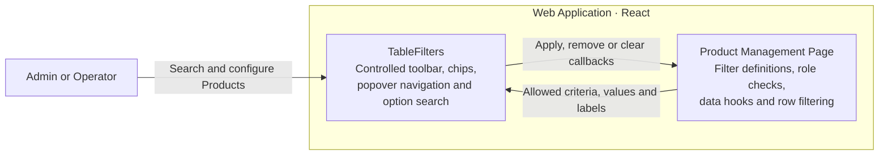
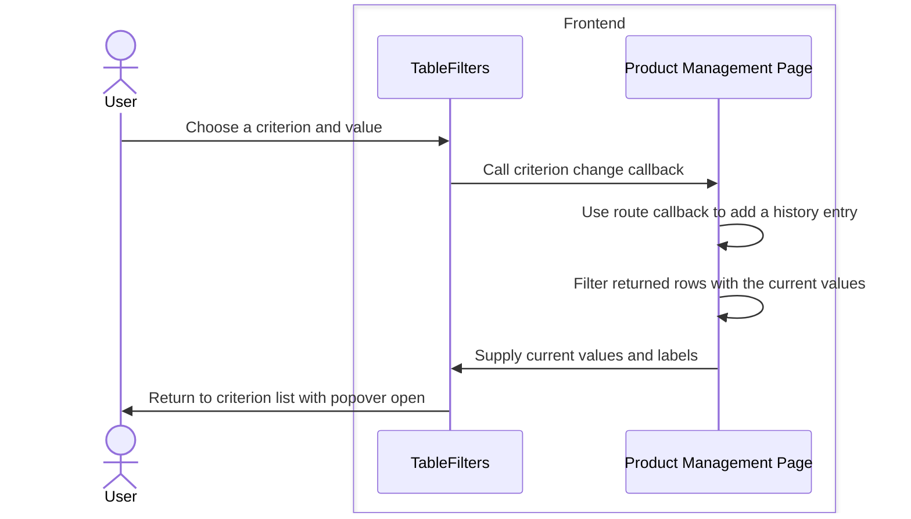

# Products Uses the Approved Shared Table Filters

Products now uses the approved Variant A layout through one shared filter component. Admins and Operators can search by Product Name and set optional criteria in one popover. This change applies the shared control to Products only. Other catalogs remain outside this ticket.

## Controlled Filter Presentation

[TableFilters](apps/web/src/components/app/table-filters.tsx) receives the allowed criteria, applied values, labels, and callbacks from the feature. It uses the existing shadcn Button and Input and the [Popover](apps/web/src/components/ui/popover.tsx) added with the shadcn CLI. The feature controls applied filters. TableFilters controls popover navigation and local option search. Data requests, User roles, query rules, and URL state stay in the feature.

The control keeps the approved prototype's search width, compact toolbar, pill chips, and right-aligned popover. Chips follow criterion definition order. The Filter button has no count. Each ordinary criterion opens a single-value list with Back navigation and a visible selected value. Selection applies the value immediately, returns to the criterion list, and keeps the popover open. Include deleted activates directly from the criterion list. Each chip opens its criterion for editing or removes that criterion alone. Close, Escape, and a click outside close the popover without changing applied values.

Toolbar Clear all appears when search or a criterion is active. Popover Clear all appears only when a criterion is active, including in the value list. Both controls clear search and optional criteria. Clear all inside the popover returns to the criterion list and keeps it open. The toolbar and chips wrap on narrow viewports.

## Products Controls Filter Rules and URL State

The [Product Management Page](apps/web/src/features/products/product-management-page.tsx) defines Lifecycle Status, Product Status, Product Category, Collection, and Include deleted in that order. Only an Admin receives Include deleted. Collection search uses the options already loaded. Small value lists have no search field or Any option.

The page keeps the search behavior from ticket 01. Product Name search runs on the server after a 250 ms delay. Previous rows remain visible during an update, with an accessible updating message. Lifecycle Status, Product Status, Product Category, and Collection filter the returned rows locally.

The [Products route](apps/web/src/routes/app.products.tsx) validates search parameters and removes unsupported parameters with a history replacement. This preserves the current path and hash. The [index route](apps/web/src/routes/app.products.index.tsx) keeps history replacement for search and new history entries for criterion changes and Clear all. Back and Forward restore the filter configuration.

The production control replaces the old selects and prototype. The prototype component, framing, labels, state display, conditional rendering, and `filterPrototype` parameter are removed. Old links with that parameter now use the production control and receive a valid URL.

## Historical Rows and Error Recovery

Included deleted Products keep their Deleted badge. Operators do not receive the historical criterion, and unauthorized URL values are removed before the request. The API remains responsible for authorization.

A table-level `403` keeps the session and shows a permission message with Clear all. The action restores defaults. It also retries a failed default query when its parameters do not change. A `401` keeps the existing authentication failure flow. When no rows match, the table tells the User to clear search or filters without another clear button.

## Architecture Views

### C4 Level 3 — Products Web Components

```mermaid
flowchart LR
  user["Admin or Operator"]
  subgraph web["Web Application · React"]
    page["Product Management Page<br/>Filter definitions, role checks,<br/>data hooks and row filtering"]
    filters["TableFilters<br/>Controlled toolbar, chips,<br/>popover navigation and option search"]
  end
  user -->|"Search and configure Products"| filters
  page -->|"Allowed criteria, values and labels"| filters
  filters -->|"Apply, remove or clear callbacks"| page
```

The shared control has no data or authorization responsibility. The Products routes validate URL state and provide navigation callbacks to the page. Domain relationships do not change, so this ticket needs no UML domain view.

### C4 Dynamic — Apply a Criterion

```mermaid
sequenceDiagram
  actor User
  box Frontend
    participant Filters as TableFilters
    participant Page as Product Management Page
  end
  User->>Filters: Choose a criterion and value
  Filters->>Page: Call criterion change callback
  Page->>Page: Use route callback to add a history entry
  Page->>Page: Filter returned rows with the current values
  Page->>Filters: Supply current values and labels
  Filters->>User: Return to criterion list with popover open
```

## Focused Coverage

The dedicated [Products filter integration tests](apps/web/src/routes/-product-filters.test.tsx) render the real route with HTTP response fixtures. Its eight scenarios prove:

- Immediate application, chip editing, selected-value text, and Back/Forward restoration.
- Local Collection search, chip order, removal of one criterion, and Clear all with the popover open.
- Search-only Clear all and outside dismissal without filter changes.
- Direct Include deleted activation and omission for Operators.
- Default-query `403` recovery without loss of the session.
- Close from the value list, Escape dismissal, and removal of the obsolete prototype URL parameter.
- Remote search delay, previous-row retention, and accessible updating feedback.
- Admin inclusion of deleted Products and their Deleted badge.

The general [Products route tests](apps/web/src/routes/-products.test.tsx) keep 32 scenarios for Product behavior, mutations, URL state, permissions, and authentication. These include invalid URL parameter normalization. Tests use the new controls where the old selects were removed. Remote refresh and deleted-row scenarios moved to the dedicated file rather than being duplicated.

## Focused Verification

The implementation phase ran these checks. This documentation update does not rerun application checks.

- First red: the dedicated Products filter scenario failed because production had no Filter button. It passed after prototype extraction and Products adoption.
- Second red: Clear all could not recover a 403 at the default remote query. It passed after the page explicitly retried that unchanged query.
- Third red: the removed prototype parameter remained in copied initial URLs. The dedicated scenario passed after Products route canonicalization.
- `node node_modules/vitest/vitest.mjs run src/routes/-product-filters.test.tsx src/routes/-products.test.tsx` from `apps/web` — 40 tests passed: 8 dedicated filter scenarios and 32 general Products scenarios. The general route suite emits existing React act warnings.
- `node node_modules/typescript/bin/tsc -b --pretty false` from `apps/web` — passed.
- Focused Oxlint on the changed TypeScript files, including the generated primitive — passed.
- `git diff --check` — passed.
- Independent Standards and Spec reviews — passed with no remaining findings. Spec independently reran the eight dedicated tests; all passed. The reviews closed findings about the shadcn primitive and test placement.

The general route tests emit existing React `act` warnings. Browser review confirmed the production toolbar, criterion list, and value list. The session then expired, and the local seed credentials were rejected. The complete browser flow and narrow-viewport layout remain visually unverified. No credentials were changed.

For this documentation update, `node node_modules/.pnpm/prettier@3.8.4/node_modules/prettier/bin/prettier.cjs --check changes.md` and `git diff --check` passed from the repository root.

## Scope Boundaries

This ticket changes shared filter presentation and Products integration. It does not change the API, shared query contracts, domain model, or other catalogs. It adds no dependency. The unrelated `.gitignore` change remains intact. Changes remain uncommitted. `pnpm quality` was not run; that gate remains with the human and CI.
